# DeployHub — Development Specification

> **Status:** Active development
> **Related documents:** [README](./README.md) · [Architecture](./docs/architecture.md)
> **Conventions:** Phases are numbered **Phase 01–09** and match the roadmap in the README.

## Table of Contents

1. [Project Overview](#1-project-overview)
2. [Project Goals](#2-project-goals)
3. [Development Principles](#3-development-principles)
4. [MVP Definition](#4-mvp-definition)
5. [Technology Stack](#5-technology-stack)
6. [High-Level Architecture](#6-high-level-architecture)
7. [Repository Structure](#7-repository-structure)
8. [Deployment Engine](#8-deployment-engine)
9. [Project Detection](#9-project-detection)
10. [Docker Build Strategy](#10-docker-build-strategy)
11. [Database Design](#11-database-design)
12. [Backend API](#12-backend-api)
13. [Deployment State Machine](#13-deployment-state-machine)
14. [Background Jobs](#14-background-jobs)
15. [Deployment Logs](#15-deployment-logs)
16. [Frontend Dashboard](#16-frontend-dashboard)
17. [Kubernetes Deployment](#17-kubernetes-deployment)
18. [Ingress and URLs](#18-ingress-and-urls)
19. [GitHub Integration](#19-github-integration)
20. [Image Tagging and Rollback](#20-image-tagging-and-rollback)
21. [Health Checks](#21-health-checks)
22. [Environment Variables and Secrets](#22-environment-variables-and-secrets)
23. [Resource Limits and Quotas](#23-resource-limits-and-quotas)
24. [Multi-Tenancy](#24-multi-tenancy)
25. [Security](#25-security)
26. [Autoscaling](#26-autoscaling)
27. [Monitoring and Observability](#27-monitoring-and-observability)
28. [Continuous Integration and Delivery](#28-continuous-integration-and-delivery)
29. [Infrastructure as Code](#29-infrastructure-as-code)
30. [Local Development Environment](#30-local-development-environment)
31. [Development Roadmap](#31-development-roadmap)
32. [MVP vs Final Version](#32-mvp-vs-final-version)
33. [Testing Strategy](#33-testing-strategy)
34. [Engineering Decisions](#34-engineering-decisions)
35. [What Not to Implement Initially](#35-what-not-to-implement-initially)
36. [Minimum Demo](#36-minimum-demo)
37. [Risks and Mitigations](#37-risks-and-mitigations)
38. [Resume Description and Skills](#38-resume-description-and-skills)
39. [Glossary](#39-glossary)
40. [Final Development Rule](#40-final-development-rule)

---

## 1. Project Overview

**DeployHub** is a self-service application deployment platform inspired by Render and Railway. A developer connects a GitHub repository, configures a few settings, clicks **Deploy**, and receives a publicly accessible application URL.

> **The user should care about their application, not the infrastructure required to run it.**

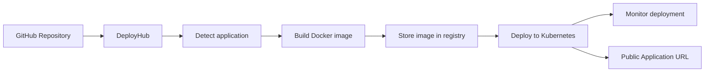

DeployHub is primarily a **Cloud/DevOps engineering portfolio project**, but the final system should be usable by other developers.

### 1.1 What makes the project interesting

DeployHub is interesting because it covers the whole software delivery lifecycle, not just one step:

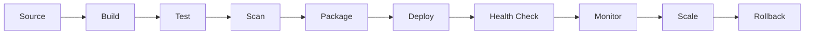

### 1.2 What DeployHub builds and what it reuses

| DeployHub builds | DeployHub reuses |
| :--- | :--- |
| The orchestration and control layer that connects every step into one developer experience | Docker/containerd (container runtime), Kubernetes (scheduler), Git/GitHub (source control), Prometheus/Grafana (monitoring) |

---

## 2. Project Goals

### 2.1 Primary goals

DeployHub should eventually allow a user to:

1. Sign in with GitHub.
2. Select one of their repositories.
3. Configure the application.
4. Click **Deploy**.
5. Automatically build the application.
6. Package it into a Docker image.
7. Push the image to a container registry.
8. Deploy the application to Kubernetes.
9. Expose the application through a public URL.
10. View deployment logs and status.
11. Redeploy when the GitHub repository changes.
12. Roll back to a previous deployment.
13. Monitor basic CPU, memory, request, and health information.

### 2.2 Secondary goals

Later versions can support: multiple replicas, horizontal autoscaling, custom domains, environment variables, secrets, build caching, deployment history, automatic rollback, resource limits, Prometheus/Grafana monitoring, GitHub webhooks, Terraform-managed infrastructure, multi-user isolation, and usage quotas.

---

## 3. Development Principles

1. **Do not build the complete platform at once.** Build in stages.
2. **Every phase must produce a working system.**
3. **Build the smallest working version first.**
4. **Build the deployment engine before the frontend.**
5. **Reuse existing tools** (Docker, Kubernetes, Prometheus). Build only the orchestration layer.
6. **Treat security as a core feature**, not a later add-on.
7. **Do not claim a feature (README, resume) until it is implemented and tested.**

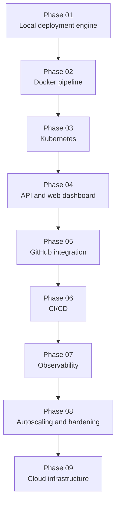

See [Development Roadmap](#31-development-roadmap) for deliverables and definitions of done.

---

## 4. MVP Definition

The first usable version is intentionally small. It proves the fundamental concept:

> **Repository → Build → Container → Running application → URL**

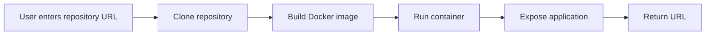

| In the MVP | Not in the MVP |
| :--- | :--- |
| Repository URL + branch + port input | Authentication |
| Clone, detect, build, run | Kubernetes |
| Basic status and logs | Autoscaling |
| Application URL (`http://localhost:<port>`) | Cloud infrastructure, custom domains |

### 4.1 MVP acceptance criteria

- [ ] `POST /deploy` with a repository URL returns a deployment ID immediately.
- [ ] A sample Python repository, a sample Node.js repository, and a repository with its own Dockerfile each deploy successfully.
- [ ] The application is reachable at the returned URL.
- [ ] Build and deploy logs can be viewed.
- [ ] An invalid repository, failed build, or crashing app results in a `FAILED` status with a readable error message.
- [ ] Stopped deployments remove their containers.

---

## 5. Technology Stack

| Layer | Technology | Purpose | Introduced in |
| :--- | :--- | :--- | :---: |
| Frontend | React, TypeScript, Vite, Tailwind CSS | Login, repository selection, deployment config, status, logs | 04 |
| Backend | Python, FastAPI, SQLAlchemy | Auth, GitHub integration, projects, deployments, Kubernetes communication, API | 01 / 04 |
| Database | PostgreSQL | Users, projects, deployments | 04 |
| Queue / Workers | Redis + Celery | Run builds and deployments in the background | 04 |
| Containers | Docker, Docker Compose | Build app images; run the DeployHub stack locally | 01 |
| Registry | GitHub Container Registry (GHCR) | Store immutable, SHA-tagged images | 02 |
| Orchestration | Kubernetes (Kind locally), Helm | Run applications with replicas, Services, Ingress | 03 |
| Authentication | GitHub OAuth | "Login with GitHub" (no passwords) | 05 |
| CI/CD | GitHub Actions | Test, build, scan, and deploy DeployHub itself | 06 |
| Monitoring | Prometheus, Grafana, Loki (optional), Alertmanager (optional) | Metrics, dashboards, logs, alerts | 07 |
| Security | Trivy, NetworkPolicies, ResourceQuotas | Image scanning, isolation | 08 |
| Infrastructure as Code | Terraform | Reproducible cloud infrastructure | 09 |
| Cloud | AWS (EC2 first, EKS later), IAM, VPC, Security Groups, S3/CloudWatch if needed | Hosting | 09 |

**Orchestration progression:** Docker Compose / `docker run` first, Kubernetes later.

**Cloud note:** for the first cloud version, an EC2-based Kubernetes cluster keeps cost and complexity manageable. EKS charges a fixed hourly control-plane fee, so check current pricing before using it.

---

## 6. High-Level Architecture

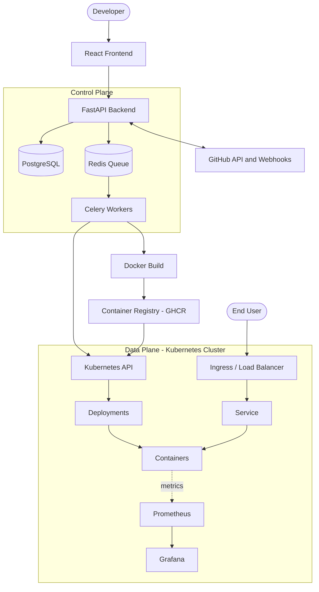

- **Control plane:** DeployHub itself (UI, API, database, queue, workers).
- **Data plane:** the Kubernetes cluster where users' applications run.

---

## 7. Repository Structure

Recommended monorepo:

```text
deployhub/
├── frontend/
│   ├── src/
│   ├── public/
│   ├── package.json
│   └── Dockerfile
│
├── backend/
│   ├── app/
│   │   ├── main.py
│   │   ├── config.py
│   │   ├── api/
│   │   │   ├── auth.py
│   │   │   ├── projects.py
│   │   │   ├── deployments.py
│   │   │   └── logs.py
│   │   ├── models/
│   │   ├── schemas/
│   │   ├── services/
│   │   │   ├── github.py
│   │   │   ├── docker.py
│   │   │   ├── kubernetes.py
│   │   │   └── deployment.py
│   │   └── workers/
│   ├── tests/
│   ├── requirements.txt
│   └── Dockerfile
│
├── infrastructure/
│   ├── docker/
│   ├── kubernetes/
│   └── terraform/
│
├── helm/
│   └── deployhub/
│
├── examples/                  # sample apps used for testing
│   ├── python-app/
│   ├── node-app/
│   └── dockerfile-app/
│
├── .github/
│   └── workflows/
│       ├── test.yml
│       ├── build.yml
│       └── deploy.yml
│
├── docs/
│   ├── architecture.md
│   ├── api.md
│   ├── database.md
│   ├── deployment-lifecycle.md
│   └── security.md
│
├── .env.example
├── docker-compose.yml
├── Makefile
├── README.md
└── LICENSE
```

---

## 8. Deployment Engine

**Build the engine first, before the frontend.** Start with a simple Python program or API.

### 8.1 Input

```json
{
  "repository": "https://github.com/example/my-api",
  "branch": "main",
  "port": 8000
}
```

Optional fields (later): `build_method` (`auto`, `dockerfile`, `python`, `node`), `start_command`, `health_path`, `env`.

### 8.2 Steps

| # | Step | Detail | On failure |
| :-: | :--- | :--- | :--- |
| 1 | Clone | `git clone --depth 1 --branch <branch> <url>`; record the commit SHA with `git rev-parse HEAD` | `FAILED` at `CLONING` (bad URL, private repo, missing branch) |
| 2 | Detect | Inspect the repository files ([Project Detection](#9-project-detection)) | `FAILED`: unsupported project |
| 3 | Decide build path | User Dockerfile, or generated Dockerfile | `FAILED` |
| 4 | Build | `docker build -t <image>:<sha> .` with a timeout | `FAILED` at `BUILDING`, include build log tail |
| 5 | Run | Start the container on a free host port | `FAILED` at `DEPLOYING` |
| 6 | Health check | Poll the app until healthy or timeout | `FAILED` at `HEALTH_CHECK`, include container logs |
| 7 | Return | Deployment ID, status, commit SHA, URL | n/a |

### 8.3 Output

```json
{
  "deployment_id": 42,
  "status": "RUNNING",
  "commit_sha": "a81f92d",
  "image": "deployhub/my-api:a81f92d",
  "url": "http://localhost:32768"
}
```

### 8.4 Container run flags (recommended from the start)

```bash
docker run -d \
  --name dh-42 \
  -p 32768:8000 \
  -e PORT=8000 \
  --memory 512m --cpus 0.5 --pids-limit 256 \
  --security-opt no-new-privileges \
  deployhub/my-api:a81f92d
```

Never use `--privileged`, never mount the Docker socket, never mount host paths.

### 8.5 Operational details

- Clone into a temporary working directory and delete it after the build.
- Apply timeouts: clone (60 s), build (10 min), health check (120 s). Values are configurable.
- Limit repository size and log size to protect the host.
- Remove the old container when a project is redeployed.

---

## 9. Project Detection

DeployHub detects common project types automatically.

| File found | Project type | Default start command | Initial support |
| :--- | :--- | :--- | :---: |
| `Dockerfile` | User-defined Docker build | defined by the Dockerfile | Yes |
| `package.json` | Node.js | `npm start` | Yes |
| `requirements.txt` | Python | `python main.py` | Yes |
| `pyproject.toml` | Python | `python main.py` | Yes |
| `pom.xml` | Java / Maven | n/a | Later |
| `build.gradle` | Java / Gradle | n/a | Later |

**Detection precedence:** `Dockerfile` → `package.json` → `requirements.txt` / `pyproject.toml` → fail with a clear message.

If a repository matches multiple types (for example `package.json` and `requirements.txt`), the user must pick the build method manually. Detection looks at the repository root only; monorepos are out of scope initially.

**Start with only Python, Node.js, and Dockerfile.** Do not support everything initially.

---

## 10. Docker Build Strategy

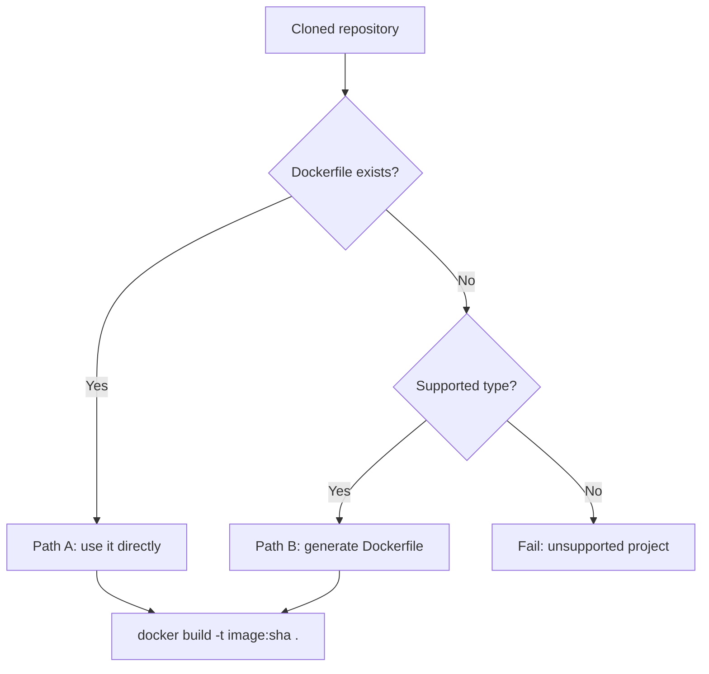

### 10.1 Path A — user provides a Dockerfile

Use it directly. Always tag with the commit SHA, never only `latest`:

```bash
docker build -t deployhub/my-app:a81f92d .
```

### 10.2 Path B — DeployHub generates a Dockerfile

Limited initially to simple, known project structures.

**Python:**

```dockerfile
FROM python:3.12-slim

WORKDIR /app

COPY requirements.txt .
RUN pip install --no-cache-dir -r requirements.txt

COPY . .

RUN useradd --uid 10001 --no-create-home appuser
USER 10001

EXPOSE 8000
CMD ["python", "main.py"]
```

**Node.js:**

```dockerfile
FROM node:22-slim

WORKDIR /app

COPY package*.json ./
RUN npm ci --omit=dev

COPY . .

USER 10001

EXPOSE 3000
CMD ["npm", "start"]
```

Notes:
- Use a numeric `USER` (such as `10001`), not a name. Kubernetes `runAsNonRoot` cannot verify named users.
- `npm ci` needs a `package-lock.json`; fall back to `npm install` if there is none.
- Use currently supported base image versions.
- Include a `.dockerignore` (`.git`, `node_modules`, `__pycache__`, `.env`) so secrets and junk never enter the image.
- The container must listen on the port provided through the `PORT` environment variable.

### 10.3 Builder evolution

| Stage | Builder |
| :--- | :--- |
| MVP | Docker CLI or Docker SDK for Python on the build host |
| Later (in-cluster, no Docker socket) | Rootless BuildKit, or Kaniko (verify its maintenance status before adopting) |

Building untrusted Dockerfiles is a security risk. See [Security](#25-security).

---

## 11. Database Design

PostgreSQL with SQLAlchemy.

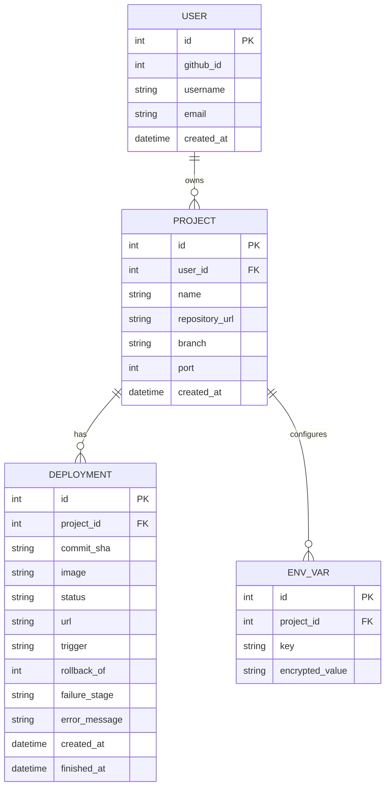

### 11.1 Initial entities

**User:** `id`, `github_id`, `username`, `email`, `created_at`
**Project:** `id`, `user_id`, `name`, `repository_url`, `branch`, `created_at`
**Deployment:** `id`, `project_id`, `commit_sha`, `image`, `status`, `url`, `created_at`, `finished_at`

### 11.2 Additions

- `Deployment.trigger`: `manual`, `webhook`, or `rollback`.
- `Deployment.rollback_of`: ID of the deployment whose image is reused.
- `Deployment.failure_stage` and `error_message`: where and why a deployment failed.
- `EnvVar` (later): values stored encrypted.
- GitHub access tokens are stored encrypted, never in plaintext.

### 11.3 Status values

`QUEUED`, `CLONING`, `BUILDING`, `PUSHING`, `DEPLOYING`, `HEALTH_CHECK`, `RUNNING`, `FAILED`, `STOPPED`

These match the [state machine](#13-deployment-state-machine) exactly.

---

## 12. Backend API

### 12.1 Endpoints

| Method | Path | Description |
| :--- | :--- | :--- |
| `GET` | `/api/auth/github/login` | Start GitHub OAuth |
| `GET` | `/api/auth/github/callback` | OAuth callback |
| `GET` | `/api/auth/me` | Current user |
| `GET` | `/api/github/repos` | List the user's repositories |
| `POST` | `/api/projects` | Create a project |
| `GET` | `/api/projects` | List projects |
| `GET` | `/api/projects/{id}` | Project details |
| `DELETE` | `/api/projects/{id}` | Delete a project and its deployments |
| `GET` | `/api/projects/{id}/deployments` | Deployment history |
| `POST` | `/api/projects/{id}/deploy` | Create a deployment |
| `GET` | `/api/deployments/{id}` | Deployment status |
| `GET` | `/api/deployments/{id}/logs` | Deployment logs |
| `GET` | `/api/deployments/{id}/logs/stream` | Live logs (SSE) |
| `POST` | `/api/deployments/{id}/restart` | Restart a deployment |
| `POST` | `/api/deployments/{id}/rollback` | Redeploy the image of this earlier deployment |
| `PUT` | `/api/projects/{id}/env` | Set environment variables (write-only) |
| `POST` | `/api/webhooks/github` | GitHub webhook receiver |
| `GET` | `/health`, `/metrics` | DeployHub's own health and Prometheus metrics |

### 12.2 Example

```text
POST /api/projects/123/deploy
```

```json
{ "branch": "main" }
```

Response (`202 Accepted`):

```json
{ "deployment_id": 42, "status": "QUEUED" }
```

```text
GET /api/deployments/42
```

```json
{
  "id": 42,
  "status": "RUNNING",
  "url": "https://weather-api.deployhub.example",
  "commit_sha": "a81f92d"
}
```

### 12.3 Error format

```json
{
  "error": {
    "code": "DEPLOYMENT_NOT_FOUND",
    "message": "Deployment 42 does not exist."
  }
}
```

| Status | Meaning |
| :---: | :--- |
| 200 / 201 / 202 | Success / created / accepted for background processing |
| 400 / 422 | Invalid input |
| 401 / 403 | Not logged in / not allowed to access this resource |
| 404 | Not found (also returned for other users' resources) |
| 429 | Rate limit exceeded |

Authorization rule: a user can only access their own projects, deployments, logs, and environment variables.

---

## 13. Deployment State Machine

A deployment is not simply `Deploy → Running`.

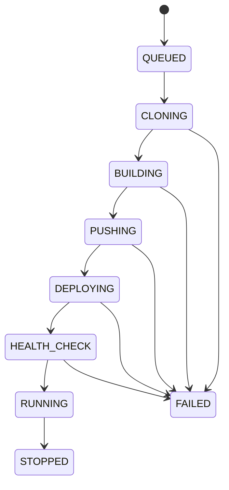

| State | Meaning | Typical failure causes |
| :--- | :--- | :--- |
| `QUEUED` | Waiting for a worker | Queue backlog |
| `CLONING` | Fetching source | Bad URL, private repo, missing branch |
| `BUILDING` | Building the image | Missing dependency, bad Dockerfile, timeout |
| `PUSHING` | Uploading to the registry | Auth error, network error |
| `DEPLOYING` | Creating or updating runtime resources | Image pull failure, invalid manifest |
| `HEALTH_CHECK` | Waiting for the app to become healthy | App crash, wrong port, no `/health` |
| `RUNNING` | Serving traffic | n/a |
| `FAILED` | Terminal error | See `failure_stage` and `error_message` |
| `STOPPED` | Intentionally stopped | n/a |

Rules: states only move forward; every transition is timestamped and logged; every `FAILED` records the stage and a human-readable reason. In the MVP (Docker only), `PUSHING` may be skipped.

---

## 14. Background Jobs

Building and deploying must never block the API request.

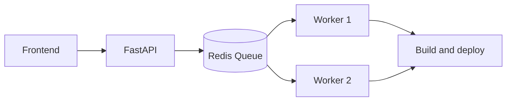

Without a queue, `POST /deploy` would wait minutes for the build and likely time out. With a queue, the API returns a deployment ID immediately and the frontend polls or streams status.

**Choice:** Redis + Celery (RQ and RabbitMQ are alternatives).

Job rules:
- One job per deployment; jobs are idempotent.
- Hard time limits per job.
- Retry only transient failures (network, registry push). Never retry a failed build automatically.
- Limit concurrent builds per worker and per user.
- Workers update the deployment status at every state change.

---

## 15. Deployment Logs

Example:

```text
Deployment #42

[12:32:01] Cloning repository...
[12:32:04] Repository cloned.
[12:32:05] Detected Python application.
[12:32:06] Building Docker image...
[12:32:42] Image built successfully.
[12:32:43] Pushing image...
[12:33:01] Image pushed.
[12:33:02] Deploying container...
[12:33:08] Health check passed.
[12:33:08] Deployment successful.
```

- **Storage:** database table for the MVP; object storage or Loki later.
- **Streaming:** Server-Sent Events (simple, one-directional) or WebSockets.
- **Redaction:** secret values and tokens must never appear in logs.
- **Limits:** cap log size per deployment.

---

## 16. Frontend Dashboard

| Page | Purpose |
| :--- | :--- |
| Login | GitHub sign-in |
| Dashboard | List projects with status and URL |
| New project | Select repository and configure |
| Deployment details | Status, commit, URL, live logs, restart, rollback |
| Settings (later) | Environment variables, resource limits |

```text
DeployHub
------------------------------------------------

Projects

+----------------+----------+----------------+
| Project        | Status   | URL            |
+----------------+----------+----------------+
| weather-api    | RUNNING  | Open           |
| todo-app       | FAILED   | View logs      |
| portfolio      | RUNNING  | Open           |
+----------------+----------+----------------+

[ + New Project ]
```

New deployment form:

```text
Repository:   [ https://github.com/user/project ]
Branch:       [ main ]
Port:         [ 8000 ]
Build method: [ Auto Detect ]

[ Deploy ]
```

Later: environment variables (`PORT=8000`, `DATABASE_URL=********`). Secrets are never displayed in plaintext after creation.

Application detail view:

```text
Application
--------------------------------
Status:       RUNNING
Replicas:     2/2
CPU:          32%
Memory:       41%
Restarts:     0

Latest deployment: #42   Commit: a81f92d   Status: SUCCESS

[View Logs]  [Restart]  [Rollback]
```

---

## 17. Kubernetes Deployment

Once Docker deployment works, move workloads to Kubernetes.

**Do not hard-code manifests per project.** Generate them dynamically (Python templates plus the Kubernetes client) or use Helm templates.

Naming rules: Kubernetes names must be lowercase, alphanumeric or `-`, and at most 63 characters, so project names are slugified.

### 17.1 Deployment

```yaml
apiVersion: apps/v1
kind: Deployment
metadata:
  name: my-app
  namespace: user-101
spec:
  replicas: 2
  strategy:
    type: RollingUpdate
    rollingUpdate:
      maxUnavailable: 0
      maxSurge: 1
  selector:
    matchLabels:
      app: my-app
  template:
    metadata:
      labels:
        app: my-app
    spec:
      securityContext:
        runAsNonRoot: true
      containers:
        - name: app
          image: ghcr.io/<owner>/my-app:a81f92d
          ports:
            - containerPort: 8000
          env:
            - name: PORT
              value: "8000"
          securityContext:
            allowPrivilegeEscalation: false
            capabilities:
              drop: ["ALL"]
          resources:
            requests:
              cpu: "100m"
              memory: "128Mi"
            limits:
              cpu: "500m"
              memory: "512Mi"
          readinessProbe:
            httpGet:
              path: /health
              port: 8000
          livenessProbe:
            httpGet:
              path: /health
              port: 8000
```

### 17.2 Service

The Service provides stable networking even when Pods change.

```yaml
apiVersion: v1
kind: Service
metadata:
  name: my-app
  namespace: user-101
spec:
  selector:
    app: my-app
  ports:
    - port: 80
      targetPort: 8000
```

### 17.3 Ingress

```yaml
apiVersion: networking.k8s.io/v1
kind: Ingress
metadata:
  name: my-app
  namespace: user-101
spec:
  ingressClassName: nginx
  rules:
    - host: abc123.deployhub.example
      http:
        paths:
          - path: /
            pathType: Prefix
            backend:
              service:
                name: my-app
                port:
                  number: 80
```

### 17.4 Operational notes

- Use the official Python `kubernetes` client; create-or-update resources idempotently.
- Private GHCR images need an `imagePullSecret` in the user's namespace.
- Rolling updates with `maxUnavailable: 0` keep the old version serving until the new one is ready.
- Local development uses Kind, Minikube, or Docker Desktop Kubernetes (see [Local Development Environment](#30-local-development-environment)).

---

## 18. Ingress and URLs

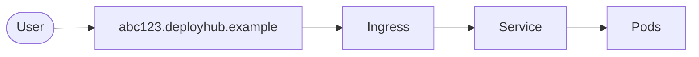

| Strategy | Example | Notes |
| :--- | :--- | :--- |
| Project-based (simple MVP) | `<project-id>.deployhub.example` | Easy to reason about |
| Random ID (scalable) | `<random-id>.deployhub.example` | Avoids name collisions |
| Custom domain (later) | `api.mywebsite.com` | Needs DNS verification |

- **Local development:** `*.localtest.me` resolves to `127.0.0.1`, so `abc123.localtest.me` works without editing the hosts file.
- **Production:** wildcard DNS record (`*.deployhub.example`) pointing at the ingress load balancer. HTTPS via cert-manager and Let's Encrypt; a wildcard certificate requires DNS-01 validation.
- Reserve names such as `www`, `api`, and `admin` so users cannot claim them.

---

## 19. GitHub Integration

### 19.1 Authentication (GitHub OAuth)

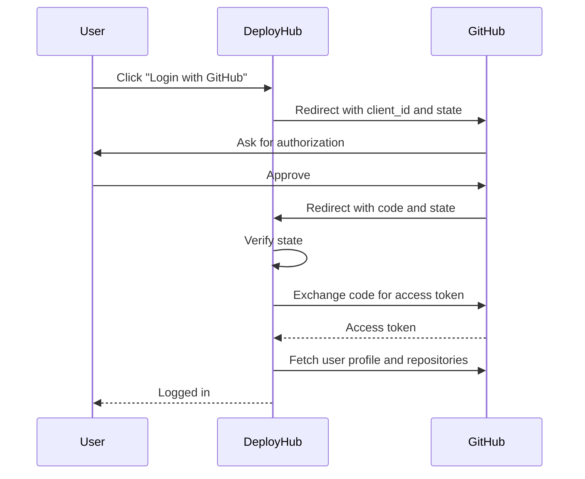

- Never ask users for their GitHub password.
- Verify the OAuth `state` parameter to prevent CSRF.
- Request the minimum scopes. Private repositories require broader access; a GitHub App is a more granular alternative for later.
- Store access tokens encrypted.

### 19.2 Repository selection

After login, list the user's repositories with search. DeployHub stores the repository URL and deployment configuration for the selected one.

### 19.3 Webhooks

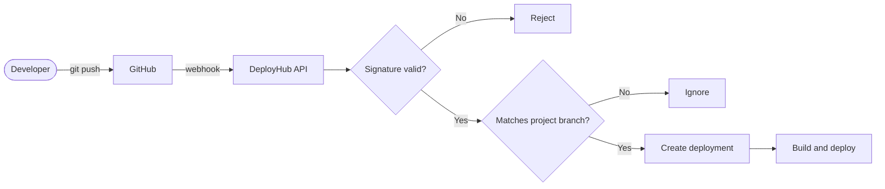

- Verify the `X-Hub-Signature-256` header: compute an HMAC-SHA256 of the raw request body with the webhook secret and compare in constant time.
- Use `X-GitHub-Delivery` to ignore duplicate deliveries.
- Only the `push` event for the configured branch triggers a deployment.
- **Do not trust arbitrary incoming webhook requests.**

---

## 20. Image Tagging and Rollback

**Never rely only on `latest`.** Use immutable tags based on the Git commit SHA:

```text
ghcr.io/<owner>/my-app:a81f92d
```

### 20.1 Rollback

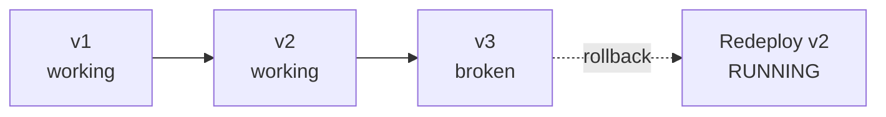

How it works:
- Because images are immutable, rollback means redeploying a previous image. No rebuild is needed.
- `POST /api/deployments/{id}/rollback` creates a **new** deployment record with `trigger = rollback`, `rollback_of = {id}`, and the same image, then deploys it.
- The database remains the source of truth for history.
- Keep the last N images per project (for example 5) and clean up older ones.

---

## 21. Health Checks

| Probe | Question | On failure |
| :--- | :--- | :--- |
| Liveness | Is the application alive? | Container is restarted |
| Readiness | Can it receive traffic? | Pod is removed from the Service |

```yaml
livenessProbe:
  httpGet:
    path: /health
    port: 8000

readinessProbe:
  httpGet:
    path: /health
    port: 8000
```

Practical rules:
- Default path `/health`, configurable per project.
- If the app has no health endpoint, fall back to a TCP check on the port, or a plain `GET /`.
- Add a startup probe or generous `initialDelaySeconds` for slow-starting apps.
- During the `HEALTH_CHECK` state, DeployHub waits up to a timeout (for example 120 s). If pods crash-loop or never become ready, the deployment becomes `FAILED` with the container's recent logs.

---

## 22. Environment Variables and Secrets

Users define variables such as `DATABASE_URL`, `API_KEY`, `SECRET_KEY`, `PORT`, `NODE_ENV`.

**Never:**
- commit secrets to Git,
- put secrets into Docker images,
- print secrets in logs,
- return secrets through normal API responses.

Implementation:
- Encrypt values at rest in the database (for example Fernet with a key from the environment).
- At deploy time, create a Kubernetes Secret and inject it with `envFrom`.
- Values are write-only in the UI after creation.
- `PORT` is set by the platform; reserve it from user override.
- Changing variables requires a redeploy.
- For advanced production use, adopt a dedicated secret manager.

---

## 23. Resource Limits and Quotas

Every application gets resource limits so one app cannot consume the whole cluster.

| Resource | Request | Limit |
| :--- | :--- | :--- |
| CPU | 100m | 500m |
| Memory | 128Mi | 512Mi |

Later, per-user quotas:

| Plan | Projects | Replicas per project | Memory per project |
| :--- | :---: | :---: | :---: |
| Free | 2 | 2 | 512 MB |

Enforce with Kubernetes `ResourceQuota` and `LimitRange` objects per namespace.

---

## 24. Multi-Tenancy

Each user's applications are isolated in their own namespace.

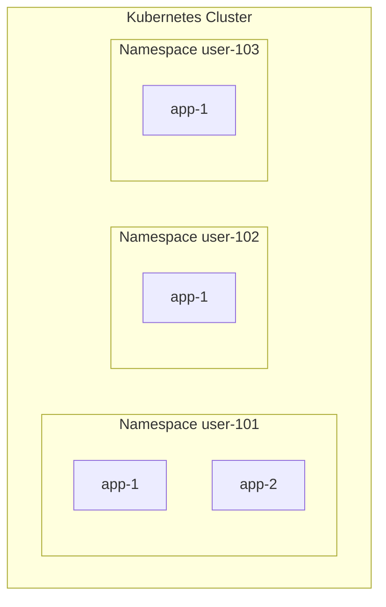

Isolation roadmap:

1. One namespace per user (early version).
2. NetworkPolicies: deny cross-namespace traffic, allow only the ingress controller, and block egress to the cloud metadata address (`169.254.169.254`).
3. ResourceQuotas and LimitRanges.
4. Pod Security Admission (restricted profile).
5. Dedicated node pools for untrusted workloads.

---

## 25. Security

Security is one of the most important parts of DeployHub. **A deployment platform executes code supplied by users.** Never blindly run arbitrary user code on the same host with unrestricted privileges.

### 25.1 Threats and mitigations

| Threat | Mitigation | Phase |
| :--- | :--- | :---: |
| Malicious user code escapes its container | No privileged containers; no host mounts; non-root; dropped capabilities | 01+ |
| Access to the host via the Docker socket | **Never mount `/var/run/docker.sock`** into application containers | 01+ |
| Resource exhaustion (CPU, memory, process bombs) | CPU, memory, and process limits; quotas | 01+ |
| Malicious Dockerfile during build | Build timeouts; isolated builder; later rootless BuildKit or Kaniko | 02+ |
| Vulnerable images | Trivy scan: block CRITICAL, warn on HIGH | 06 |
| One tenant attacking another | Namespaces, NetworkPolicies, quotas | 03+ |
| Stealing cloud credentials from inside a container | Never expose host credentials; block metadata address | 03+ |
| Fake webhook requests | HMAC signature verification | 05 |
| Account takeover or data leaks | GitHub OAuth only; encrypted tokens and secrets; per-user authorization | 05 |
| API abuse | Rate limiting | 08 |
| Secret leakage | Never in Git, images, logs, or API responses | 08 |

### 25.2 Authentication and authorization

- **Authentication:** GitHub OAuth.
- **Authorization:** a user may only access their own projects, deployments, logs, and environment variables.

### 25.3 Image scanning flow

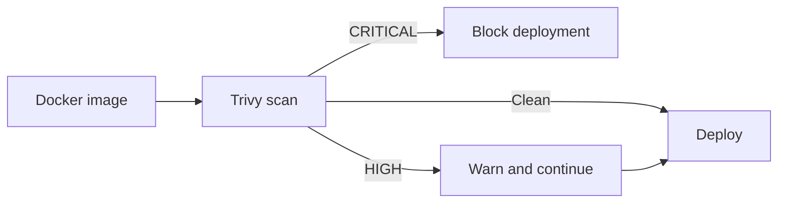

### 25.4 Rate limiting

| Endpoint | Limit |
| :--- | :--- |
| Login | 10 requests/minute |
| Deploy | 5 requests/minute |
| Logs | 60 requests/minute |

### 25.5 Container security checklist

- [ ] Not privileged
- [ ] Non-root user
- [ ] Resource limits set
- [ ] No host filesystem mounts
- [ ] No Docker socket
- [ ] Network access restricted where appropriate

---

## 26. Autoscaling

Horizontal Pod Autoscaling (HPA) adds or removes pods based on load.

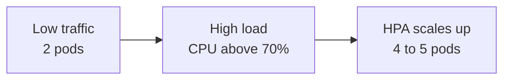

Example policy: minimum 1 replica, maximum 5, target CPU 70%.

```yaml
apiVersion: autoscaling/v2
kind: HorizontalPodAutoscaler
metadata:
  name: my-app
  namespace: user-101
spec:
  scaleTargetRef:
    apiVersion: apps/v1
    kind: Deployment
    name: my-app
  minReplicas: 1
  maxReplicas: 5
  metrics:
    - type: Resource
      resource:
        name: cpu
        target:
          type: Utilization
          averageUtilization: 70
```

Prerequisites: the cluster needs **metrics-server**, and pods must define **CPU requests** (utilization is measured against the request).

---

## 27. Monitoring and Observability

### 27.1 Application metrics (Prometheus + Grafana)

Prometheus collects: CPU, memory, requests, latency, errors, pod health, and container restarts. Grafana shows dashboards:

```text
Application: weather-api

CPU       ███████░░░  67%
Memory    █████░░░░░  48%

Requests/minute
████████████████████

Latency
███████████

Errors
██
```

### 27.2 Platform metrics (DeployHub itself)

Track: `deployment_count`, `deployment_success_count`, `deployment_failure_count`, `deployment_duration`, `active_projects`, `active_deployments`, `worker_queue_length`.

Questions these answer:
- How many deployments are running?
- How long do deployments take?
- How often do builds fail?
- Which projects consume the most resources?
- Are workers overloaded?

### 27.3 Logging architecture

Separate application logs from DeployHub logs.

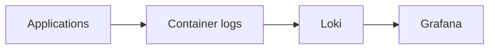

DeployHub itself writes structured JSON logs:

```json
{
  "level": "INFO",
  "service": "deployment-worker",
  "deployment_id": "42",
  "event": "image_build_completed"
}
```

Useful alerts (optional, Alertmanager): high failure rate, queue backlog, pod crash loops.

---

## 28. Continuous Integration and Delivery

GitHub Actions tests and ships **DeployHub itself**. (User application builds are performed by DeployHub's workers, not by GitHub Actions.)

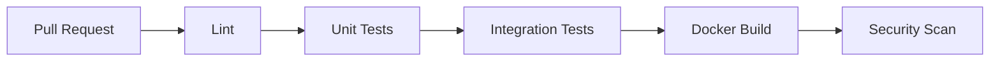

Production pipeline on the `main` branch:

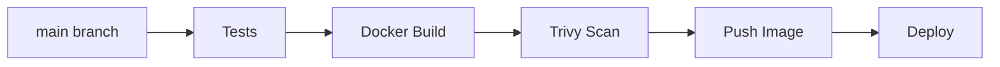

| Workflow file | Purpose |
| :--- | :--- |
| `.github/workflows/test.yml` | Lint and tests on pull requests |
| `.github/workflows/build.yml` | Build, scan, and push images |
| `.github/workflows/deploy.yml` | Deploy to the cluster |

Practices: tag images with the commit SHA, store credentials in GitHub Actions secrets, and enable branch protection requiring passing checks.

---

## 29. Infrastructure as Code

Do not create the final infrastructure manually. Use Terraform.

```text
terraform/
├── main.tf
├── variables.tf
├── outputs.tf
├── provider.tf
└── modules/
    ├── networking/
    ├── compute/
    ├── kubernetes/
    └── monitoring/
```

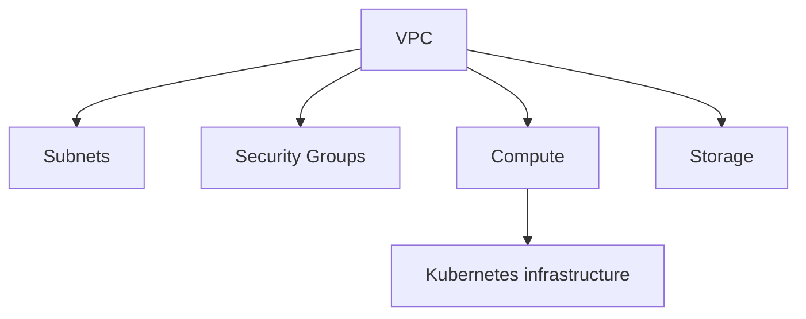

Practices: remote state (for example S3 with locking), separate variables per environment, never commit secrets or state files, and run `terraform plan` in CI before `apply`.

---

## 30. Local Development Environment

The entire control plane should run locally.

```bash
docker compose up
```

| Service | URL |
| :--- | :--- |
| Frontend | http://localhost:3000 |
| Backend | http://localhost:8000 |
| Grafana | http://localhost:3001 |
| PostgreSQL | localhost:5432 |
| Redis | localhost:6379 |
| Prometheus | http://localhost:9090 |

`docker-compose.yml` runs: frontend, backend, worker, PostgreSQL, Redis, Prometheus, Grafana.

### 30.1 Local Kubernetes (Kind recommended)

```bash
kind create cluster --name deployhub --config kind-config.yaml
```

```yaml
kind: Cluster
apiVersion: kind.x-k8s.io/v1alpha4
nodes:
  - role: control-plane
    kubeadmConfigPatches:
      - |
        kind: InitConfiguration
        nodeRegistration:
          kubeletExtraArgs:
            node-labels: "ingress-ready=true"
    extraPortMappings:
      - containerPort: 80
        hostPort: 80
        protocol: TCP
      - containerPort: 443
        hostPort: 443
        protocol: TCP
```

Then install the ingress-nginx controller using the Kind-specific manifest from the Kind documentation. Minikube and Docker Desktop Kubernetes also work.

### 30.2 Configuration

Commit a `.env.example`; never commit `.env` (add it to `.gitignore`).

```text
DATABASE_URL=
REDIS_URL=
GITHUB_CLIENT_ID=
GITHUB_CLIENT_SECRET=
GITHUB_WEBHOOK_SECRET=
SECRET_KEY=
ENCRYPTION_KEY=
REGISTRY_URL=
REGISTRY_USERNAME=
REGISTRY_TOKEN=
BASE_DOMAIN=localtest.me
KUBECONFIG=
```

A `Makefile` with targets such as `make up`, `make test`, `make lint`, and `make kind` keeps common commands one-liners.

---

## 31. Development Roadmap

### 31.1 Phases and definition of done

| Phase | Milestone | Definition of done |
| :---: | :--- | :--- |
| **01** | Local deployment engine | Script deploys the Python, Node.js, and Dockerfile sample apps and prints a working URL |
| **02** | Docker pipeline | Generated Dockerfiles, health checks, state machine, SHA tags; failures report stage and reason |
| **03** | Kubernetes integration | Sample apps run on Kind through generated Deployment, Service, and Ingress; reachable by hostname |
| **04** | API and web dashboard | PostgreSQL, FastAPI, queue, React UI; deploy from the UI and watch status and logs |
| **05** | GitHub integration | OAuth login, repository selection, webhooks; `git push` triggers a redeploy |
| **06** | CI/CD | PR checks pass; images published to GHCR with SHA tags; DeployHub deploys itself from `main` |
| **07** | Observability | Grafana shows CPU, memory, and requests per app, plus platform metrics |
| **08** | Autoscaling and hardening | HPA scales an app under load; rollback, secrets, limits, Trivy, rate limiting work |
| **09** | Cloud infrastructure | Terraform creates the AWS environment; a public demo URL works |


## 32. MVP vs Final Version

```mermaid
flowchart LR
    MVP["MVP<br/>Repo, Docker,<br/>Application, URL"] --> V2["Version 2<br/>OAuth, webhooks, registry,<br/>Kubernetes, Ingress, rollback"]
    V2 --> V3["Version 3<br/>CI/CD, Trivy, HPA,<br/>Prometheus, Grafana,<br/>secrets, multi-user isolation"]
```

| Version | Features |
| :--- | :--- |
| **MVP** | Basic dashboard, repository URL, Docker build, deployment, logs, application URL |
| **Version 2** | GitHub OAuth, webhooks, Kubernetes, registry, automatic deployment, rollback |
| **Version 3** | CI/CD, HPA, Prometheus, Grafana, Trivy, resource limits, secrets, multi-user isolation |

### 32.1 Final architecture

```mermaid
flowchart TD
    User([User]) --> UI[React UI]
    UI --> API[FastAPI Control API]
    API --> PG[(PostgreSQL)]
    API --> GH[GitHub]
    API --> RD[(Redis)]
    RD --> JW[Job Workers]
    JW --> DB[Docker Build]
    JW --> KA[Kubernetes API]
    DB --> CR[Container Registry]
    KA --> K[Kubernetes]
    CR --> K
    K --> IN[Ingress]
    K --> PR[Prometheus]
    IN --> Users([End Users])
    PR --> GR[Grafana]
```

---

## 33. Testing Strategy

| Type | What it tests | Tools |
| :--- | :--- | :--- |
| Unit | Project creation, state transitions, GitHub service, authorization, config validation | pytest |
| Integration | API → database → deployment worker | pytest, FastAPI TestClient, test containers |
| Deployment | Repository → Docker image → Kubernetes → running application | Kind in CI, sample apps in `examples/` |
| Failure | See below | pytest, intentionally broken sample repos |

Failure tests (intentionally break things):

- invalid repository
- failed Docker build
- application crash
- invalid port
- image pull failure
- Kubernetes deployment failure
- health check failure

Also test authorization (user A cannot read user B's deployment) and webhook signature rejection.

---

## 34. Engineering Decisions

### 34.1 What not to build yourself

| Do not build | Use instead |
| :--- | :--- |
| A container runtime | Docker / containerd / Kubernetes |
| A scheduler | Kubernetes |
| A Git implementation | Git / GitHub |
| A monitoring system | Prometheus / Grafana |

**Do build the orchestration and control layer.** That is the actual DeployHub project: the system that connects GitHub, Docker, Registry, Kubernetes, Monitoring, and Cloud into one usable developer experience.

### 34.2 Decision log

| Decision | Reasoning |
| :--- | :--- |
| Engine before frontend | Proves Repository → Build → Container → URL first |
| Docker first, Kubernetes second | Every phase stays a working system |
| Job queue for builds | Builds take minutes; the API must respond immediately |
| Immutable commit-SHA image tags | Reliable rollback and reproducibility |
| Generated manifests or Helm | Per-project hard-coded YAML does not scale |
| One namespace per user | Simple tenant isolation to start |
| SSE for log streaming | Simple and one-directional |
| Redis + Celery | Reasonable and well-documented for a student project |
| EC2-based cluster before EKS | Lower cost and complexity |

---

## 35. What Not to Implement Initially

Avoid these in the first MVP:

- Multiple cloud providers
- Billing system
- Custom domains
- Multi-region deployment
- GPU scheduling
- Service mesh
- Kubernetes operator
- Advanced RBAC
- Complex networking
- Custom container runtime
- Full Terraform automation
- AI-based deployment detection

These are useful later but dramatically increase the scope.

---

## 36. Minimum Demo

A successful first demonstration:

1. Open DeployHub.
2. Select a GitHub repository.
3. Click **Deploy**.
4. DeployHub clones the repository.
5. A Docker image is built.
6. The image is pushed to the registry.
7. The Kubernetes deployment starts.
8. The health check succeeds.
9. DeployHub displays the URL.
10. Open the URL.
11. The application works.

Then demonstrate automatic deployment:

```mermaid
flowchart LR
    P[git push] --> W[GitHub webhook] --> D[Automatic deployment] --> N[New version live]
```

Finally demonstrate autoscaling:

```mermaid
flowchart LR
    T[Increase traffic] --> C[CPU increases] --> H[HPA detects load] --> S["2 pods become 4 pods"]
```

Prepare the demo in advance: keep a sample app with a `/health` endpoint, a load-generation command ready, and a recorded backup video in case of network issues.

---

## 37. Risks and Mitigations

| Risk | Impact | Mitigation |
| :--- | :--- | :--- |
| Scope grows too large | Project never finishes | Follow the phases; skip optional features |
| Kubernetes networking and ingress difficulty | Delays | Start with Kind; keep Docker deployment as a fallback |
| Untrusted code compromises the host | Serious security incident | Isolation, limits, no privileged containers; do not expose publicly before hardening |
| Cloud costs | Unexpected bills | Use Terraform destroy after demos; set budget alerts; prefer EC2 over EKS early |
| Long builds | Poor user experience | Queue, timeouts, build caching later |
| GitHub rate limits and API changes | Failures | Cache repository lists; handle errors gracefully |
| Secrets leak | Credential compromise | Encryption, redaction, no secrets in Git |

---

## 38. Resume Description and Skills

### 38.1 Resume description

After the project actually works:

> **DeployHub — Self-Service Cloud Deployment Platform**
> Built a developer platform that automatically builds, containerizes, and deploys GitHub applications to Kubernetes. Implemented Docker-based builds, GitHub webhooks, CI/CD, deployment status/logs, health checks, rolling deployments, monitoring with Prometheus/Grafana, and Kubernetes autoscaling.

**Do not claim features on your CV until they are implemented and tested.**

### 38.2 Skills practiced

Linux, Git, GitHub, REST APIs, Python, FastAPI, PostgreSQL, Docker, Docker Compose, container registries, GitHub Actions, CI/CD, Kubernetes, Helm, Ingress, Redis, background workers, Prometheus, Grafana, Terraform, AWS, IAM, networking, security, observability, autoscaling.

The most important learning objective is not memorizing technologies. It is understanding how they work together:

```mermaid
flowchart LR
    Code --> Git --> CICD[CI/CD] --> Docker --> Registry --> Kubernetes --> Networking --> Monitoring --> Scaling
```

---

## 39. Glossary

| Term | Meaning |
| :--- | :--- |
| **Image** | A packaged, read-only snapshot of an application and its dependencies |
| **Container** | A running instance of an image |
| **Registry** | A server that stores images (for example GHCR) |
| **Pod** | The smallest runnable unit in Kubernetes; wraps one or more containers |
| **Deployment** | A Kubernetes object that keeps a desired number of identical pods running |
| **Service** | A stable network address for a set of pods |
| **Ingress** | Rules that route external HTTP(S) traffic to Services |
| **Namespace** | A logical partition of a Kubernetes cluster |
| **HPA** | Horizontal Pod Autoscaler; adds or removes pods based on load |
| **Liveness / Readiness probe** | Health checks for "is it alive" and "can it take traffic" |
| **Helm** | Package manager and templating tool for Kubernetes manifests |
| **Webhook** | An HTTP callback sent by GitHub when an event (such as a push) occurs |
| **SSE** | Server-Sent Events; one-way streaming from server to browser |
| **Trivy** | A vulnerability scanner for container images |
| **IaC** | Infrastructure as Code; defining infrastructure in version-controlled files |
| **Kind** | Kubernetes in Docker; a lightweight local cluster |

---

## 40. Final Development Rule

**Build the smallest working version first.**

Do not start by creating 50 Kubernetes YAML files. Start with:

```mermaid
flowchart LR
    A[GitHub Repo] --> B[Docker Build] --> C[Docker Run] --> D[Working URL]
```

Then replace **Docker Run** with **Kubernetes**.

Then add: GitHub webhooks, CI/CD, monitoring, autoscaling, security, and Terraform.

This keeps DeployHub achievable while allowing it to grow into a genuinely advanced Cloud/DevOps project.
