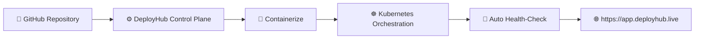
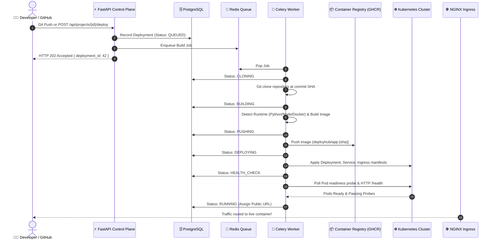
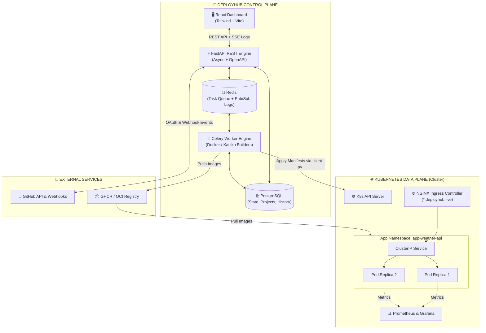
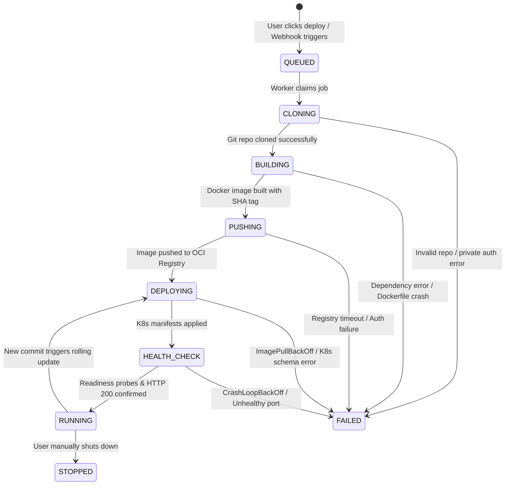
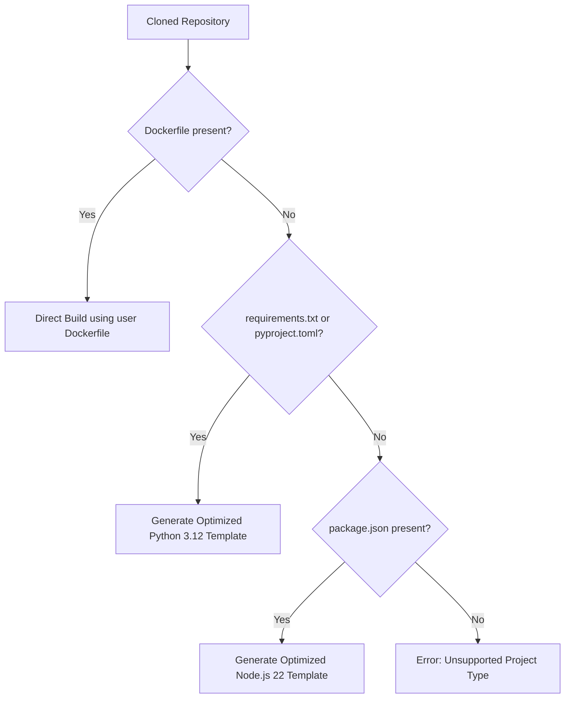
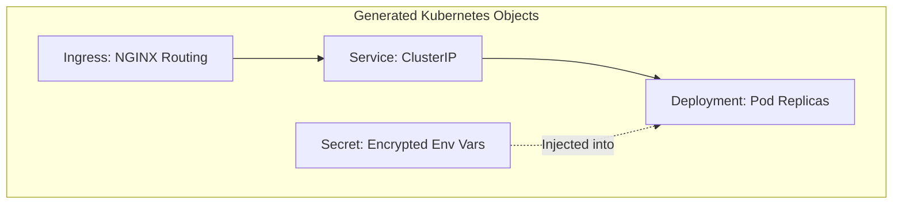
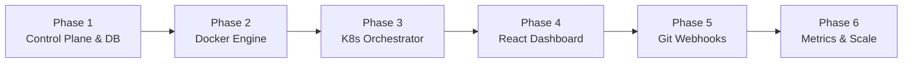

# ☁️ DeployHub — Platform Architecture & Technical Blueprint

> **"From Source Code to Production URL on Kubernetes — Zero Infrastructure Friction."**  
> *A modern, self-service Developer Platform (PaaS) inspired by Render and Railway.*

---

## 💡 1. The Core Idea

### The Developer Friction
Today, turning code into a running cloud service requires a developer to master:
* Writing custom Dockerfiles and multi-stage builds.
* Configuring container registries and auth secrets.
* Writing hundreds of lines of Kubernetes manifests (`Deployment`, `Service`, `Ingress`, `ConfigMap`, `Secret`).
* Setting up TLS certificates, DNS routing, and reverse proxies.
* Configuring CI/CD pipelines, health check probes, and rolling update strategies.

Commercial PaaS providers (Render, Railway, Heroku) solve this, but at the cost of **steep vendor pricing, strict resource limits, and vendor lock-in**.

### What DeployHub Is
**DeployHub** is a lightweight, open, self-hosted Cloud Control Plane that runs on standard Kubernetes. It acts as the intelligent orchestration bridge between a GitHub repository and a running production pod.



> [!TIP]
> **The Golden Rule of DeployHub:**  
> Developers should care exclusively about their application code, **not** the underlying cloud infrastructure required to serve it. Connect a repo, pick a branch, click **Deploy**, and receive a live public HTTPS endpoint.

---

## 🔄 2. End-to-End Deployment Lifecycle

When a developer clicks **Deploy** (or pushes a commit to GitHub), DeployHub executes a rigorous multi-stage pipeline:



---

## 🏛️ 3. System Architecture: Control Plane vs Data Plane

DeployHub cleanly separates the management system (**Control Plane**) from the customer workloads (**Data Plane / Cluster**):



---

## 🎛️ 4. Deployment State Machine

Deployments are strictly deterministic state machines. A deployment never skips stages and transitions forward with guaranteed audit trails:



| State | Responsibility | Failure Recovery / Diagnostics |
| :--- | :--- | :--- |
| `QUEUED` | Job stored in Redis queue awaiting worker availability | Worker auto-scaling / queue depth alerts |
| `CLONING` | Fetch repository at exact commit SHA | Check git credentials and branch existence |
| `BUILDING` | Analyze project and execute multi-stage container build | Full compiler/build log stream saved |
| `PUSHING` | Push immutable image tag `image:{commit_sha}` to registry | Retry transient network push errors |
| `DEPLOYING` | Apply Kubernetes manifests (Deployment, Service, Ingress) | Validate Kubernetes schema and namespaces |
| `HEALTH_CHECK` | Await pod liveness/readiness check (HTTP 200 on port) | Capture pod stderr/stdout crashes |
| `RUNNING` | Ingress routes live public domain traffic | Monitored by Prometheus |

---

## 🛠️ 5. The Complete Technology Stack

DeployHub does not build custom schedulers or runtimes. It orchestrates the world's best cloud-native technologies:

| Layer | Technology | Why This Specific Tool? |
| :--- | :--- | :--- |
| **Frontend UI** | **React + Vite + Tailwind CSS** | Blazing fast SPA, real-time reactive state, terminal log streaming views. |
| **Control Plane API** | **FastAPI (Python 3.12)** | Async I/O, native OpenAPI docs, Pydantic type validation, high throughput. |
| **Asynchronous Engine** | **Celery + Redis** | Heavyweight container builds and K8s syncs never block user web requests. |
| **Database** | **PostgreSQL + SQLAlchemy** | ACID-compliant state, relational integrity for apps, deployments, and logs. |
| **Log Streaming** | **Redis Pub/Sub + SSE** | Low-latency live build and runtime logs streamed directly to the browser. |
| **Container Engine** | **Docker Engine / Kaniko** | OCI-compliant builds; Kaniko allows unprivileged container-in-container builds. |
| **Registry** | **GitHub Container Registry (GHCR)** | Secure, immutable image storage with SHA-based tagging. |
| **Scheduler** | **Kubernetes (Minikube / k3s / EKS)** | Production-grade container lifecycle, auto-healing, and workload isolation. |
| **Traffic & Ingress** | **NGINX Ingress + Cert-Manager** | Automatic wildcard routing (`*.deployhub.live`) and zero-touch TLS certificates. |
| **Observability** | **Prometheus + Grafana** | Pod CPU, memory usage telemetry, and automated HPA autoscaling metrics. |

---

## ⚙️ 6. Under-The-Hood Mechanics: "The Magic"

### A. Intelligent Runtime Auto-Detection
Developers don't need to write a Dockerfile. DeployHub inspects the codebase and auto-generates optimized, secure multi-stage builds:



#### Auto-Generated Python Blueprint:
```dockerfile
FROM python:3.12-slim
WORKDIR /app
COPY requirements.txt .
RUN pip install --no-cache-dir -r requirements.txt
COPY . .
RUN useradd --uid 10001 --no-create-home appuser
USER 10001
EXPOSE 8000
CMD ["python", "main.py"]
```

#### Auto-Generated Node.js Blueprint:
```dockerfile
FROM node:22-slim
WORKDIR /app
COPY package*.json ./
RUN npm ci --omit=dev
COPY . .
RUN chown -R node:node /app
USER node
EXPOSE 3000
CMD ["npm", "start"]
```

---

### B. Dynamic Kubernetes Object Generation
DeployHub dynamically creates and reconciles 4 Kubernetes primitives for every application:



1. **`Deployment`**: Manages Pod replicas, rolling update strategy (`maxUnavailable: 0`, `maxSurge: 1`), and health probes.
2. **`Service`**: Internal `ClusterIP` routing traffic on target container ports (8000 / 3000 / custom).
3. **`Ingress`**: Dynamically binds a custom subdomain (e.g. `weather-api.deployhub.live`) to the service.
4. **`Secret`**: Securely mounts user-defined environment variables as container runtime secrets.

---

### C. Zero-Downtime Rollbacks
Every single deployment is tagged with its immutable Git commit SHA:
$$\text{Image Tag} = \text{registry.deployhub.live/user/repo}:\mathbf{commit\_sha}$$

* **How Rollback Works:** If a new build fails or introduces a critical bug, clicking **Rollback** does **not** re-clone or re-build.
* **Instant switch:** DeployHub updates the Kubernetes `Deployment` image pointer directly back to the previously verified SHA tag.
* **Duration:** Rollback takes $< 2$ seconds.

---

## 🗺️ 7. Phased Implementation Steps (0 to Live)



### Step 1: Control Plane Foundation
* Set up FastAPI application structure with SQLAlchemy and PostgreSQL.
* Implement database models: `User`, `Project`, `Deployment`, `EnvironmentVariable`.
* Configure Redis and Celery worker task definitions.

### Step 2: Build & Containerization Engine
* Build Celery worker task for git repository cloning.
* Implement language detection engine (detecting `requirements.txt`, `package.json`, or existing `Dockerfile`).
* Implement Docker build engine with log capture and streaming to Redis.
* Integrate container registry authentication and pushing (GHCR).

### Step 3: Kubernetes Deployment Engine
* Integrate `kubernetes-client` in Python to connect to local Minikube / k3s cluster.
* Implement dynamic manifest generation for `Deployment`, `Service`, `Ingress`, and `Secret`.
* Implement health-check pollers: query pod readiness and liveness endpoints.
* Implement the instant rollback engine.

### Step 4: Developer Web Dashboard
* Build React UI with Tailwind CSS.
* Pages: Project List, Create Project (GitHub repo picker), Deployment View.
* Build a real-time deployment status indicator with live terminal log streaming via Server-Sent Events (SSE).

### Step 5: Git Automation & Webhook Ingestion
* GitHub OAuth integration for one-click repository import.
* Webhook receiver endpoint (`POST /api/webhooks/github`) to trigger automated builds on `git push`.
* Post commit status checks back to GitHub (Pending 🟡, Success 🟢, Failed 🔴).

### Step 6: Observability, Metrics & Autoscaling
* Configure Prometheus metrics exporter for pod resource usage (CPU / Memory).
* Embed real-time resource graphs inside the React dashboard.
* Configure Kubernetes Horizontal Pod Autoscaler (HPA) to scale pods based on traffic spikes.

---

## 🌟 Why DeployHub Stands Out

> [!NOTE]
> **Summary of Key Advantages:**
> 1. **Complete DevOps Lifecycle:** Connects Git, Docker, Kubernetes, Ingress, and Observability in one pipeline.
> 2. **No Proprietary Lock-in:** Produces pure, standard OCI Docker images and standard Kubernetes manifests.
> 3. **Rock-Solid Fault Tolerance:** Asynchronous queue design ensures API requests never timeout, and state machine transitions provide instant debugging clarity.
