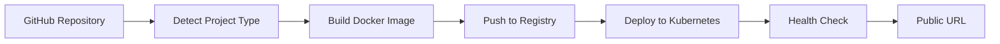
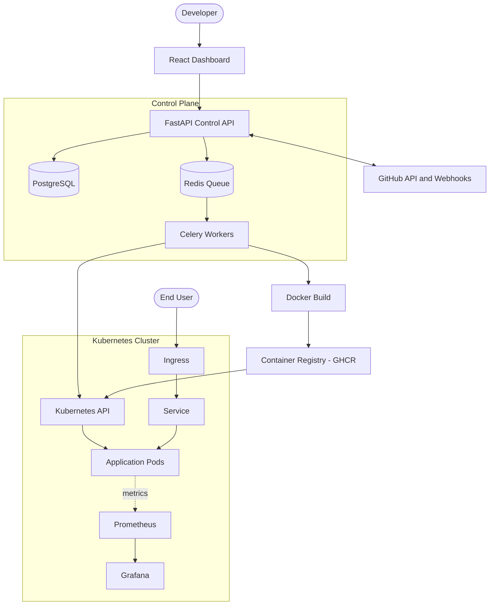
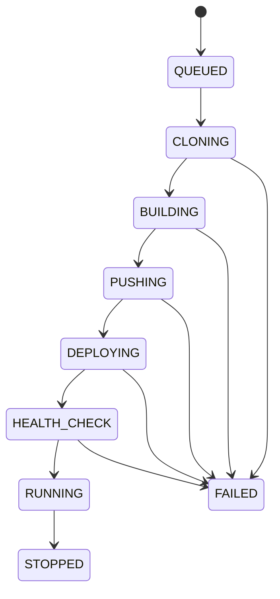

# ☁️ DeployHub

<div align="center">

### Automated Self-Service Application Deployment Platform
*Inspired by Render and Railway — From Source Code to Production URL on Kubernetes*

[](LICENSE)
[](https://kubernetes.io)
[](https://docker.com)
[]()

</div>

---

## 📌 Overview

**DeployHub** is a self-service PaaS-style deployment platform designed to remove cloud infrastructure friction for developers.

The core philosophy is simple:
> **Developers should care about their application, not the infrastructure required to run it.**

A developer connects a GitHub repository, configures a few settings, clicks **Deploy**, and receives a live public URL. DeployHub handles everything in between: detecting the runtime, building a Docker image, pushing it to a registry, creating Kubernetes resources, running health checks, and streaming logs.



DeployHub is built as a Cloud/DevOps engineering portfolio project, but is designed to be usable by other developers.

> **What DeployHub builds vs. reuses:** DeployHub does **not** implement its own container runtime, scheduler, Git, or monitoring system. It uses Docker, Kubernetes, GitHub, and Prometheus/Grafana. The project is the **orchestration and control layer** that connects them into one developer experience.

---

## 🚀 Features

- **GitHub Integration:** Deploy from a repository and branch; auto-deploy on `git push` via webhooks.
- **Automated Containerization:** Detects Python, Node.js, or an existing Dockerfile and builds an image.
- **Kubernetes Orchestration:** Generates Deployments, Services, and Ingress for each application.
- **Deployment Lifecycle Tracking:** Every deployment moves through a clear state machine.
- **Live Logs & Health Checks:** Streamed build/deploy logs and liveness/readiness probes.
- **Rollbacks & Environment Variables:** Redeploy a previous image; manage secrets securely.
- **Monitoring & Autoscaling:** Prometheus/Grafana metrics and Horizontal Pod Autoscaling.

> Features marked 📅 in the [Project Status](#-project-status) table are planned, not yet implemented.

---

## 🏗️ System Architecture



For a component-by-component explanation, see [docs/architecture.md](docs/architecture.md).

---

## ⚙️ Deployment Lifecycle

Every deployment moves through explicit states, which makes failures easy to locate and debug.



---

## 🧰 Tech Stack

| Layer | Technology |
| :--- | :--- |
| **Frontend** | React, TypeScript, Vite, Tailwind CSS |
| **Backend** | Python, FastAPI, SQLAlchemy |
| **Database** | PostgreSQL |
| **Queue / Workers** | Redis + Celery |
| **Authentication** | GitHub OAuth |
| **Containers** | Docker, Docker Compose |
| **Registry** | GitHub Container Registry (GHCR) |
| **Orchestration** | Kubernetes (Kind for local development), Helm |
| **Routing** | Kubernetes Ingress with wildcard subdomains |
| **CI/CD** | GitHub Actions |
| **Monitoring** | Prometheus, Grafana, Loki |
| **Security** | Trivy, NetworkPolicies, ResourceQuotas |
| **Infrastructure as Code** | Terraform |
| **Cloud** | AWS (EC2 / EKS, VPC, IAM) |

---

## 📋 Implementation Roadmap

Each phase produces a working system. The platform is built in stages, smallest working version first.

| Phase | Milestone | Focus Areas |
| :---: | :--- | :--- |
| **01** | **Local Deployment Engine** | Git clone, project detection, `docker build` and `docker run` |
| **02** | **Docker Pipeline** | Dockerfile generation, health checks, deployment state machine |
| **03** | **Kubernetes Integration** | Deployment, Service, Ingress, per-user namespaces |
| **04** | **API & Web Dashboard** | FastAPI, PostgreSQL, React UI, live log streaming (SSE/WebSockets) |
| **05** | **GitHub Integration** | OAuth login, repository selection, webhooks, auto-deploy |
| **06** | **CI/CD** | GitHub Actions, registry pushes, commit-SHA image tags, Trivy scans |
| **07** | **Observability** | Prometheus, Grafana, health alerts, platform metrics |
| **08** | **Autoscaling & Hardening** | HPA, rollback, secrets, resource limits, rate limiting |
| **09** | **Cloud Infrastructure** | Terraform, AWS (EC2/EKS), production deployment |

---

## 📊 Project Status

| Feature | Status |
| :--- | :---: |
| Clone repo + Docker build + run container | ✅ Done (Phase 01) |
| Runtime Auto-Detection (Python, Node.js, Dockerfile) | ✅ Done (Phase 01) |
| Deterministic Deployment State Machine | ✅ Done (Phase 01) |
| HTTP Health Checks & Crash Diagnostics | ✅ Done (Phase 01) |
| Sample Test Applications (`examples/`) | ✅ Done (Phase 01) |
| Automated Test Suite (pytest unit & e2e) | ✅ Done (Phase 01) |
| FastAPI backend + PostgreSQL | 📅 Planned (Phase 04) |
| Web dashboard (React + Tailwind) | 📅 Planned (Phase 04) |
| Kubernetes deployment (Deployment, Service, Ingress) | 🚧 In progress (Phase 03) |
| GitHub OAuth + webhooks | 📅 Planned (Phase 05) |
| CI/CD pipeline (GitHub Actions) | 📅 Planned (Phase 06) |
| Prometheus / Grafana monitoring | 📅 Planned (Phase 07) |
| Autoscaling (HPA) | 📅 Planned (Phase 08) |
| Terraform + AWS | 📅 Planned (Phase 09) |

✅ Done  ·  🚧 In progress  ·  📅 Planned

---

## 🗂️ Repository Structure

```text
deployhub/
├── backend/
│   ├── app/
│   │   ├── config.py          # App settings and environment defaults
│   │   └── engine/            # Phase 01 Core Deployment Engine
│   │       ├── models.py      # State machine models & schemas
│   │       ├── cloner.py      # Git cloning and commit-SHA extraction
│   │       ├── detector.py    # Runtime auto-detection
│   │       ├── templates.py   # Secure non-root Dockerfile generators
│   │       ├── builder.py     # Docker build with streaming logs
│   │       ├── runner.py      # Isolated container execution with resource limits
│   │       ├── health.py      # HTTP polling health checker with crash detection
│   │       ├── orchestrator.py# State machine lifecycle coordinator
│   │       └── cli.py         # Interactive CLI runner
│   ├── tests/                 # Unit and end-to-end integration tests
│   └── requirements.txt
├── examples/                  # Sample applications for deployment testing
│   ├── python-app/            # Python / requirements.txt sample
│   ├── node-app/              # Node.js / package.json sample
│   └── dockerfile-app/        # Custom Dockerfile sample
├── docs/                      # Technical blueprints and specifications
├── Makefile                   # Convenient CLI targets (test, demo, clean)
├── .env.example               # Environment variables template
├── .gitignore
├── README.md
└── LICENSE
```

---

## 🚀 Quickstart & Demo (Phase 01)

You can run DeployHub's core deployment engine and test applications immediately:

### 1. Setup Environment
```bash
# Clone the repository
git clone https://github.com/AdityaPatra-dev/DeployHub.git
cd DeployHub

# Set up virtual environment and install dependencies
make venv
```

### 2. Run Tests
```bash
# Run full unit and end-to-end integration test suite
make test
```

### 3. Deploy Sample Applications via CLI
```bash
# Deploy Python sample app
make demo-python

# Deploy Node.js sample app
make demo-node

# Deploy Custom Dockerfile sample app
make demo-docker

# Clean up running test containers
make clean
```

---

## 🔒 Security

DeployHub runs code supplied by users, so security is a core design concern: non-root containers, no privileged mode, no Docker socket exposure, CPU/memory limits, per-user namespaces, image scanning with Trivy, signed webhook verification, and rate limiting. See the security section of [docs/architecture.md](docs/architecture.md#9-security-considerations).

---

## 📚 Documentation

- [Architecture](docs/architecture.md)
- [DeployHub Development Specification](./DeployHub_Development_Specification.md)

More documents (API reference, database, deployment lifecycle) will be added as each phase is built.

---

## 📄 License

This project is licensed under the MIT License — see the [LICENSE](LICENSE) file for details.
