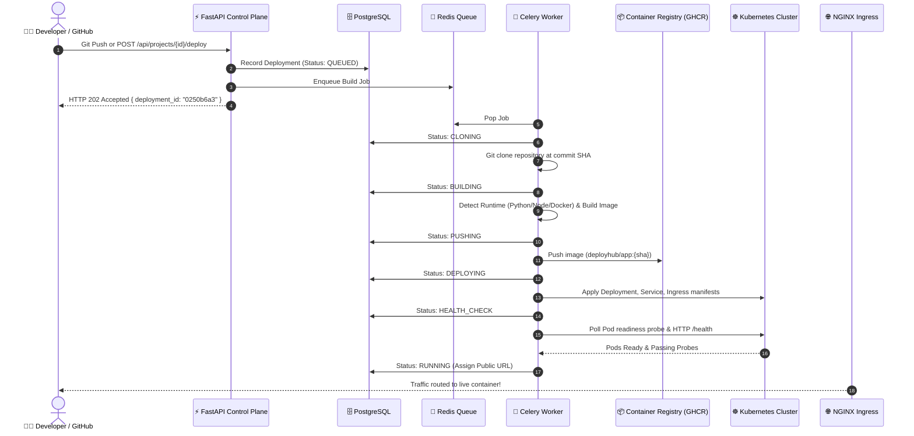
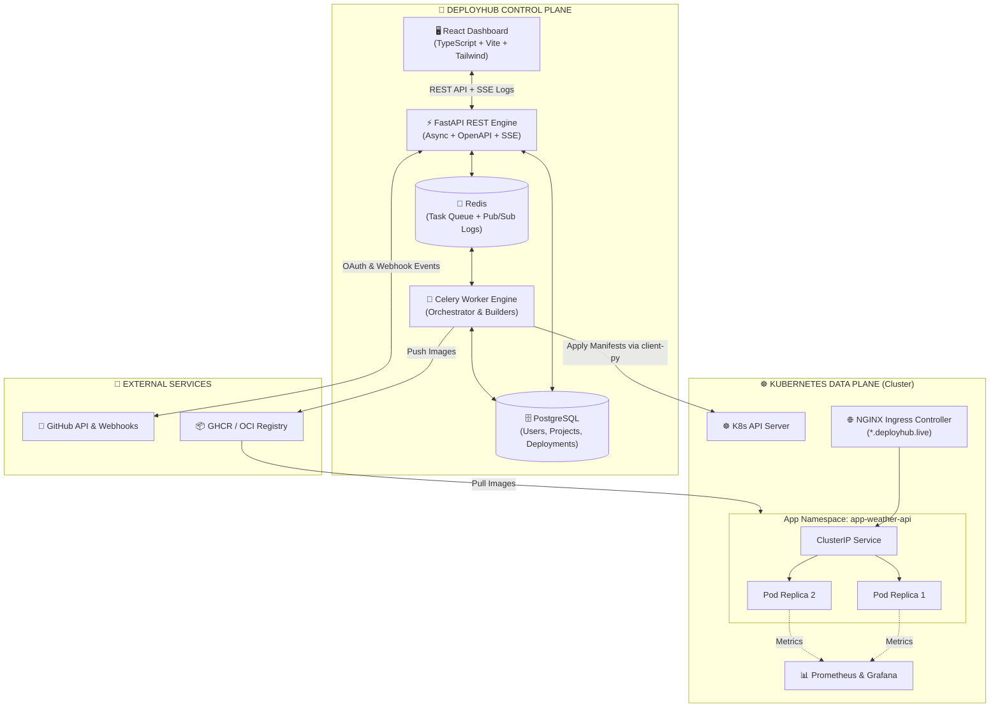
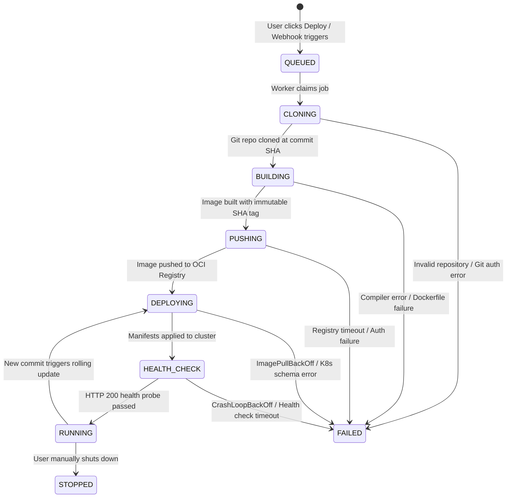
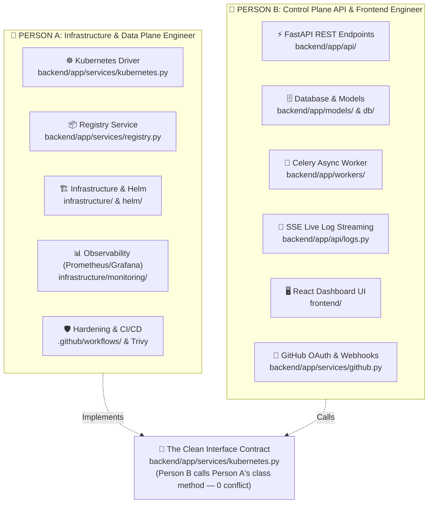

# ☁️ DeployHub

<div align="center">

### Modern Self-Service Developer Platform (PaaS)
*“From Source Code to Production URL on Kubernetes — Zero Infrastructure Friction.”*  
*Inspired by Render and Railway*

[](LICENSE)
[](backend/tests/)
[](https://python.org)
[](https://fastapi.tiangolo.com)
[](https://docker.com)
[](https://kubernetes.io)

</div>

---

## 📌 1. Overview & Motivation

Turning raw application code into a secure, running cloud service is painful. Developers typically have to master:
- Writing complex multi-stage Dockerfiles and container optimization.
- Manually configuring container registries, authentication, and credentials.
- Writing hundreds of lines of Kubernetes YAML manifests (`Deployment`, `Service`, `Ingress`, `Secret`, `ConfigMap`, `ResourceQuota`).
- Configuring reverse proxies, domain routing, TLS certificates, and health probes.
- Setting up CI/CD pipelines, zero-downtime rolling updates, and log aggregation.

Commercial PaaS providers (Render, Railway, Heroku) solve this friction, but introduce **steep monthly bills, restrictive compute limits, and proprietary vendor lock-in**.

### 💡 The Core Philosophy
> **"Developers should care exclusively about their application code, not the underlying cloud infrastructure required to serve it."**

**DeployHub** is a lightweight, open-source, self-hosted Cloud Control Plane that connects GitHub repositories directly to running workloads on Kubernetes. Simply connect a repository, pick a branch, and receive a live public HTTPS endpoint.

---

## ⚡ 2. Comparison: How DeployHub Compares

| Feature | Raw Kubernetes | Commercial PaaS (Render / Railway) | DeployHub |
| :--- | :---: | :---: | :---: |
| **Developer Experience** | ❌ High cognitive load (YAML, networking) | ✅ Instant git-push deployments | ✅ Instant git-push deployments |
| **Hosting Cost** | Low / Variable | ❌ Expensive monthly tier markups | ✅ Minimal (Self-hosted on any VM / K8s) |
| **Vendor Lock-in** | None | ❌ High proprietary lock-in | ✅ Zero (Standard OCI & K8s primitives) |
| **Infrastructure Control**| Full control | ❌ Black box | ✅ 100% Transparent & customizable |
| **Multi-Tenancy** | Manual RBAC | Automated | ✅ Per-user namespace isolation |
| **Automated Builds** | Manual CI/CD setup | Automated | ✅ Built-in runtime detection & builder |

---

## 🔄 3. End-to-End Deployment Lifecycle

When a developer clicks **Deploy** (or pushes a commit to GitHub), DeployHub executes an automated multi-stage pipeline:



---

## 🏛️ 4. System Architecture: Control Plane vs Data Plane

DeployHub cleanly isolates the orchestration plane (**Control Plane**) from application customer workloads (**Data Plane**):



---

## 🎛️ 5. Deployment State Machine

Deployments adhere to a strictly deterministic state machine with full failure auditability:



---

## 📊 6. Project Status & Roadmap

| Phase | Milestone | Focus Areas | Status |
| :---: | :--- | :--- | :---: |
| **01** | **Local Deployment Engine** | Git cloner, runtime auto-detection, Docker builder, isolated runner, health checks, CLI | <div align="center">✅ **Completed**</div> |
| **02** | **Docker Pipeline & Registry** | Secure Dockerfile generation, non-root UID 10001, SHA tagging, GHCR registry push | <div align="center">🟡 **In Progress**</div> |
| **03** | **Kubernetes Integration** | Dynamic manifests (Deployment, Service, Ingress), Kind/k3s cluster driver, namespace isolation | <div align="center">⏳ **Next Up**</div> |
| **04** | **API & Web Dashboard** | FastAPI REST endpoints, PostgreSQL (SQLAlchemy), Celery + Redis, React UI, SSE log streaming | <div align="center">⏳ **Next Up**</div> |
| **05** | **GitHub Integration** | GitHub OAuth 2.0 ("Login with GitHub"), repo selector, HMAC webhook receiver | <div align="center">📅 **Planned**</div> |
| **06** | **CI/CD Pipeline** | GitHub Actions workflows, image publishing with SHA tags, automated Trivy scanning | <div align="center">📅 **Planned**</div> |
| **07** | **Observability** | Prometheus metric scraping, Grafana dashboards for CPU/RAM/requests, platform health telemetry | <div align="center">📅 **Planned**</div> |
| **08** | **Autoscaling & Hardening** | Horizontal Pod Autoscaler (HPA), instant rollback engine, NetworkPolicies, ResourceQuotas | <div align="center">📅 **Planned**</div> |
| **09** | **Cloud Infrastructure** | Terraform IaC modules (AWS VPC, Subnets, EKS/EC2), production Helm chart | <div align="center">📅 **Planned**</div> |

---

## 👥 7. Team Work Division: 2-Person Parallel Execution Plan

To execute the remaining phases efficiently with **zero Git merge conflicts** and complete decoupling, the architecture is split into two specialized tracks with a strict code boundary.



### 👤 Person A — Platform & Infrastructure Engineer (Data Plane & DevOps)
> **Domain:** Everything between the Docker image and running production workloads on Kubernetes.
* **Owned Directories:**
  * `backend/app/services/kubernetes.py` (Kubernetes client & manifest manager)
  * `backend/app/services/registry.py` (Container registry push service)
  * `infrastructure/` (Kind cluster configs, NGINX Ingress, Prometheus, Terraform)
  * `helm/` (Helm charts for DeployHub)
  * `.github/workflows/` (GitHub Actions CI/CD)
* **Concrete Deliverables:**
  1. **Phase 02 (Registry)**: Complete `registry.py` to push images to GHCR using SHA tags.
  2. **Phase 03 (Kubernetes Engine)**: Build `kubernetes.py` generating dynamic `Deployment`, `Service`, `Ingress`, and `Secret` manifests, plus Kind local cluster setup.
  3. **Phase 06 (CI/CD)**: Write GitHub Actions PR check workflows and Trivy security scans.
  4. **Phase 07 (Observability)**: Create Prometheus scrapers and Grafana dashboards.
  5. **Phase 08 & 09 (Hardening & Cloud)**: Add HPA autoscaling, NetworkPolicies, and Terraform AWS modules.

---

### 👤 Person B — Control Plane & Full-Stack Engineer (API & UI)
> **Domain:** Everything the developer interacts with: REST API, database, async queues, logs, and frontend.
* **Owned Directories:**
  * `frontend/` (React + TypeScript + Tailwind SPA)
  * `backend/app/api/` (FastAPI routes: projects, deployments, logs, auth, webhooks)
  * `backend/app/models/` & `backend/app/schemas/` (SQLAlchemy & Pydantic models)
  * `backend/app/db/` (PostgreSQL session and migrations)
  * `backend/app/workers/` (Celery background build/deploy tasks)
  * `backend/app/services/github.py` (GitHub OAuth & Webhooks)
* **Concrete Deliverables:**
  1. **Phase 04 (API & DB)**: PostgreSQL models (`User`, `Project`, `Deployment`, `EnvVar`) and FastAPI endpoints.
  2. **Phase 04 (Async Workers & SSE)**: Celery task queue executing the orchestrator in the background and streaming live logs to frontend via Server-Sent Events (SSE).
  3. **Phase 04 (Dashboard UI)**: React dashboard with project creation, status badge, and terminal-style log viewer.
  4. **Phase 05 (GitHub Integration)**: GitHub OAuth login flow and webhook receiver for auto-deployments on `git push`.

---

### 🤝 The Zero-Conflict Integration Boundary
Person A and Person B can work completely in parallel without blocking each other:
1. **Directory Isolation**: Person A and Person B never edit the same files.
2. **Interface Contract**: Person A exposes a single well-typed class in `backend/app/services/kubernetes.py`:
   ```python
   class KubernetesService:
       def deploy_app(self, deployment_id: str, app_name: str, image: str, port: int, env: dict) -> K8sResult: ...
       def get_logs(self, app_name: str) -> str: ...
       def delete_app(self, app_name: str) -> bool: ...
   ```
3. **Mocking**: While Person A builds the Kubernetes driver, Person B uses the existing local container runner or a mock. Integrating the real Kubernetes service requires **exactly 1 line of code change in Person B's worker**!

---

## 🗂️ 8. Repository Structure

```text
DeployHub/
├── backend/
│   ├── app/
│   │   ├── config.py              # Application settings and environment defaults
│   │   ├── engine/                # Core Deployment Engine (Phase 01)
│   │   │   ├── models.py          # State machine models & schemas
│   │   │   ├── cloner.py          # Git cloner with commit-SHA extraction
│   │   │   ├── detector.py        # Runtime auto-detection (Python, Node, Docker)
│   │   │   ├── templates.py       # Secure non-root Dockerfile generators
│   │   │   ├── builder.py         # Docker image builder with log streaming
│   │   │   ├── runner.py          # Container runner with cpus/memory/pid limits
│   │   │   ├── health.py          # HTTP health checker with crash diagnostics
│   │   │   ├── orchestrator.py    # State machine lifecycle coordinator
│   │   │   └── cli.py             # Interactive CLI runner
│   │   ├── api/                   # [Person B] FastAPI REST endpoints
│   │   ├── db/                    # [Person B] PostgreSQL engine & sessions
│   │   ├── models/                # [Person B] SQLAlchemy database entities
│   │   ├── schemas/               # [Person B] Pydantic request/response schemas
│   │   ├── workers/               # [Person B] Celery async queue workers
│   │   └── services/
│   │       ├── kubernetes.py      # [Person A] Kubernetes client driver
│   │       ├── registry.py        # [Person A] GHCR / OCI registry service
│   │       └── github.py          # [Person B] GitHub OAuth & webhooks
│   ├── tests/                     # Unit and end-to-end integration tests
│   └── requirements.txt
├── frontend/                      # [Person B] React + Vite + Tailwind dashboard
├── infrastructure/                # [Person A] Kind, K8s manifests, Terraform
├── helm/                          # [Person A] Helm chart for DeployHub
├── examples/                      # Test applications for deployment verification
│   ├── python-app/                # Python / requirements.txt sample
│   ├── node-app/                  # Node.js / package.json sample
│   └── dockerfile-app/            # Custom Dockerfile sample
├── docs/                          # Blueprints, architecture, and specifications
├── Makefile                       # Developer shortcuts (test, demo, clean)
├── .env.example                   # Environment configuration template
├── .gitignore
├── README.md
└── LICENSE
```

---

## 🚀 9. Quickstart & Testing (Phase 01)

You can run DeployHub's core deployment engine and verify sample applications right now:

### 1. Setup Environment
```bash
# Clone the repository
git clone https://github.com/AdityaPatra-dev/DeployHub.git
cd DeployHub

# Set up virtual environment and install dependencies
make venv
```

### 2. Run Test Suite (13/13 Passing)
```bash
# Run unit & end-to-end integration tests
make test
```

### 3. Deploy Sample Applications via CLI
```bash
# 1. Deploy Python application (auto-generates Python 3.12 Dockerfile)
make demo-python

# 2. Deploy Node.js application (auto-generates Node 22 Dockerfile)
make demo-node

# 3. Deploy custom Dockerfile application
make demo-docker

# 4. Clean up any test containers
make clean
```

Sample CLI output:
```text
🚀 Initiating deployment for: ./examples/python-app (branch: main)

[01:04:58] [QUEUED] Deployment 0250b6a3 queued for python-demo
[01:04:58] [CLONING] Fetching repository: ./examples/python-app (branch: main)
[01:04:58] [CLONING] Prepared local repository from examples/python-app at SHA 41412bc
[01:04:58] [BUILDING] Inspecting repository and detecting application runtime...
[01:04:58] [BUILDING] Detected runtime: python via 'requirements.txt' (Port: 8000)
[01:04:58] [BUILDING] Building Docker image: deployhub/python-demo:41412bc
[01:04:59] [BUILDING] Successfully built image: deployhub/python-demo:41412bc
[01:04:59] [DEPLOYING] Starting container 'dh-python-demo-0250b6a3' (Port mapping: 32000->8000)...
[01:04:59] [DEPLOYING] Container started: cc85a8a3aedd
[01:04:59] [HEALTH_CHECK] Awaiting health check on http://127.0.0.1:32000/health...
[01:05:00] [HEALTH_CHECK] Health check passed successfully!
[01:05:00] [RUNNING] Deployment completed successfully. Live URL: http://127.0.0.1:32000
```

---

## 🔒 10. Security Architecture

DeployHub runs untrusted user code, so security is enforced by default from the ground up:
* **Non-Root Execution**: Auto-generated images mandate numeric UID `10001` (`USER 10001`), complying with Kubernetes `runAsNonRoot` requirements.
* **Privilege Restriction**: Containers run strictly with `--security-opt no-new-privileges` and without `--privileged`.
* **Resource Quotas**: Hard CPU (`0.5`), memory (`512MB`), and process PID (`256`) ceilings prevent denial of service and runaway workloads.
* **Credential Isolation**: `.dockerignore` shielding prevents `.git`, `.env`, keys, and sensitive tokens from ever baking into images.
* **Network Isolation**: Applications run inside dedicated Kubernetes namespaces with strict NetworkPolicies.

---

## 📚 11. Documentation

- [Platform Architecture & Blueprint](./DeployHub_Notion_Project_Proposal.md)
- [Complete Development Specification](./DeployHub_Development_Specification.md)
- [Architecture Deep Dive](docs/architecture.md)

---

## 📄 12. License

This project is licensed under the MIT License — see the [LICENSE](LICENSE) file for details.
