# DeployHub Architecture

This document explains how DeployHub is structured, how a deployment flows through the system, and why key design decisions were made.

**Contents**
1. [Purpose](#1-purpose)
2. [High-Level Architecture](#2-high-level-architecture)
3. [Components](#3-components)
4. [Data Model](#4-data-model)
5. [Deployment Flow](#5-deployment-flow)
6. [Deployment State Machine](#6-deployment-state-machine)
7. [Kubernetes Layout](#7-kubernetes-layout)
8. [CI/CD and Rollback](#8-cicd-and-rollback)
9. [Security Considerations](#9-security-considerations)
10. [Key Design Decisions](#10-key-design-decisions)
11. [Development Environments](#11-development-environments)
12. [Evolution by Phase](#12-evolution-by-phase)

---

## 1. Purpose

DeployHub lets a developer connect a GitHub repository and receive a live public URL without managing infrastructure. DeployHub is the **control layer** that connects existing tools into one workflow:

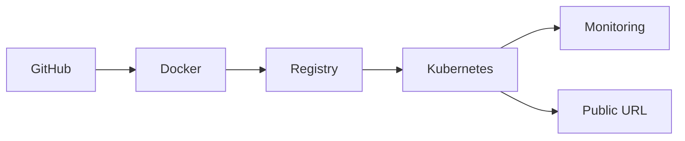

It does not build its own container runtime, scheduler, Git implementation, or monitoring system. Its value is the orchestration between them.

---

## 2. High-Level Architecture

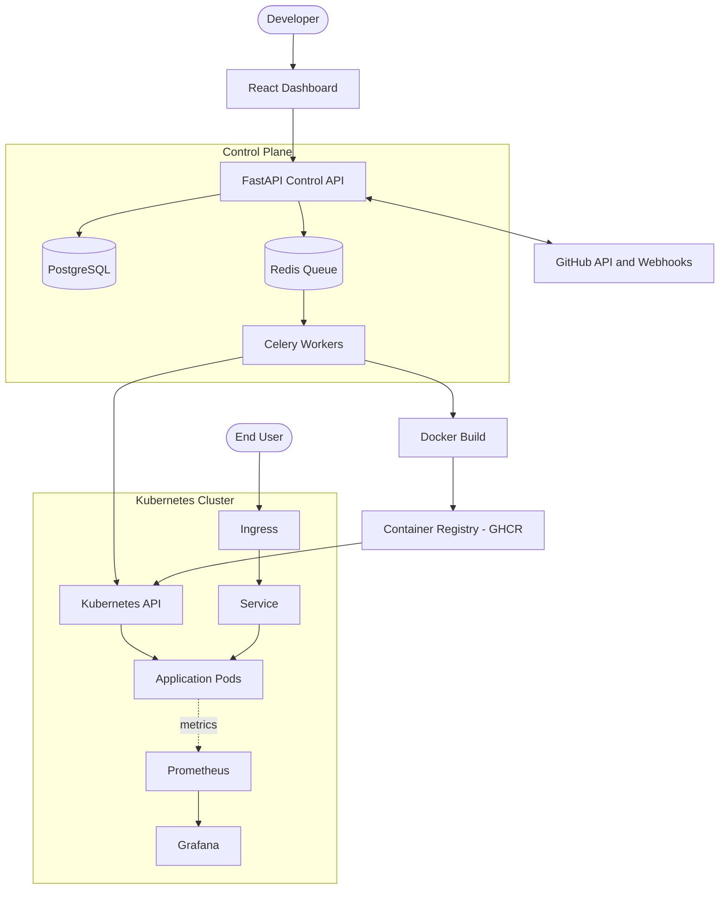

There are two halves:
- **Control plane:** DeployHub itself (UI, API, database, queue, workers).
- **Data plane:** the Kubernetes cluster where users' applications actually run.

---

## 3. Components

### 3.1 Frontend (React + TypeScript + Vite + Tailwind)
The web dashboard.
- GitHub login
- Repository selection
- Deployment configuration (branch, port, build method)
- Deployment status and live logs
- Application list and details

### 3.2 Backend API (Python + FastAPI)
The control plane.
- Authentication and authorization
- Project and deployment management
- GitHub integration (OAuth, repository listing, webhooks)
- Creating deployment jobs and exposing status and logs
- Communicating with Kubernetes

| Module | Responsibility |
| :--- | :--- |
| `api/` | HTTP endpoints (auth, projects, deployments, logs) |
| `models/` | SQLAlchemy database models |
| `schemas/` | Request and response validation |
| `services/github.py` | GitHub OAuth, repository access, webhooks |
| `services/docker.py` | Image builds and registry pushes |
| `services/kubernetes.py` | Creating and updating cluster resources |
| `services/deployment.py` | Orchestrates the full deployment flow |
| `workers/` | Background job execution |

### 3.3 Database (PostgreSQL)
Stores users, projects, and deployments. See [Data Model](#4-data-model).

### 3.4 Queue and Workers (Redis + Celery)
Builds and deployments take minutes, so they must not block API requests. The API creates a deployment record, places a job on the queue, and immediately returns a deployment ID. Workers run the build and deploy steps in the background.

### 3.5 Build System (Docker)
Clones the repository, detects the project type, builds a Docker image, and tags it with the Git commit SHA.

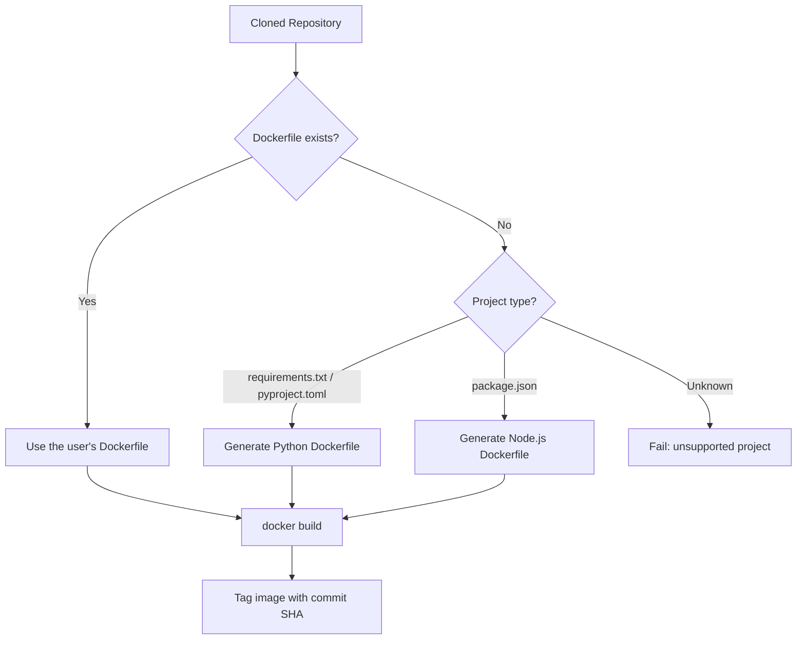

Initial supported types: Python, Node.js, and user-provided Dockerfiles.

### 3.6 Container Registry (GHCR)
Stores built images. Images are tagged with the commit SHA (for example `my-app:a81f92d`), never relying only on `latest`.

### 3.7 Kubernetes
Runs user applications. For each deployment DeployHub generates a **Deployment** (pods, limits, probes), a **Service** (stable networking), and an **Ingress** (public routing). See [Kubernetes Layout](#7-kubernetes-layout).

### 3.8 Monitoring (Prometheus + Grafana)
Prometheus collects CPU, memory, request, latency, error, and restart metrics. Grafana provides dashboards. Loki can be added later for centralized logs.

---

## 4. Data Model

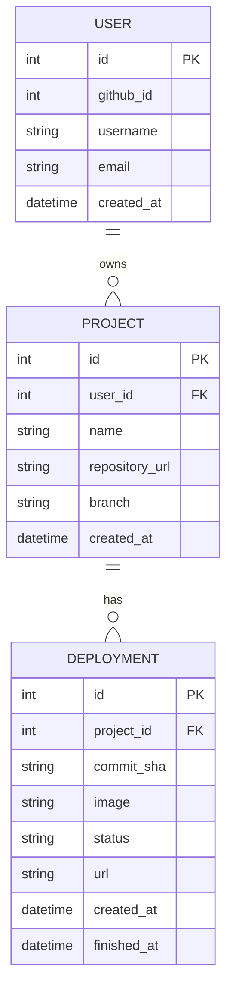

`status` is one of: `QUEUED`, `CLONING`, `BUILDING`, `PUSHING`, `DEPLOYING`, `HEALTH_CHECK`, `RUNNING`, `FAILED`, `STOPPED`.

---

## 5. Deployment Flow

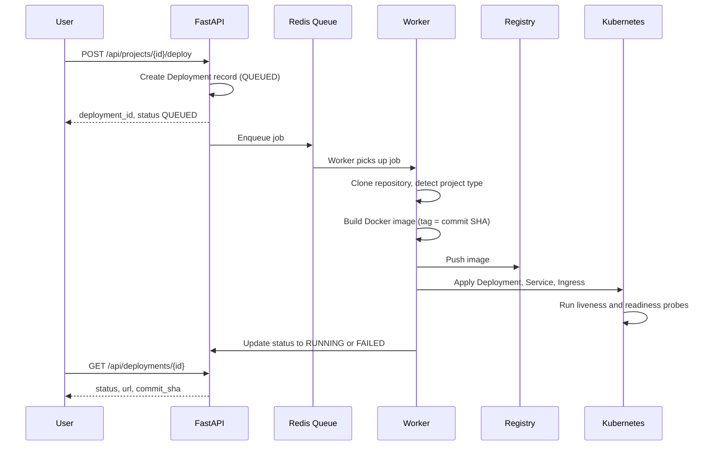

Because the API returns immediately, the frontend can poll the status endpoint or receive live updates over SSE/WebSockets.

---

## 6. Deployment State Machine

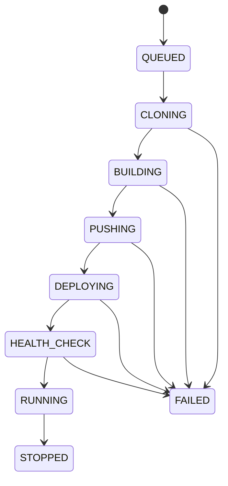

A multi-state lifecycle, instead of a plain "deploy → running", shows exactly where a failure happened and what the user should see.

---

## 7. Kubernetes Layout

### 7.1 Request path to a running app

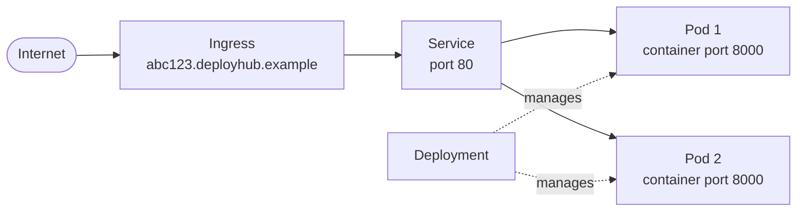

- **Deployment:** keeps the desired number of pods running and defines the image, resource limits, and health probes.
- **Service:** gives pods a stable address even when individual pods are replaced.
- **Ingress:** routes `<random-id>.deployhub.example` to the right Service.

Manifests are generated dynamically (or from Helm templates), never hard-coded per project.

### 7.2 Multi-tenant isolation

Each user gets a dedicated namespace.

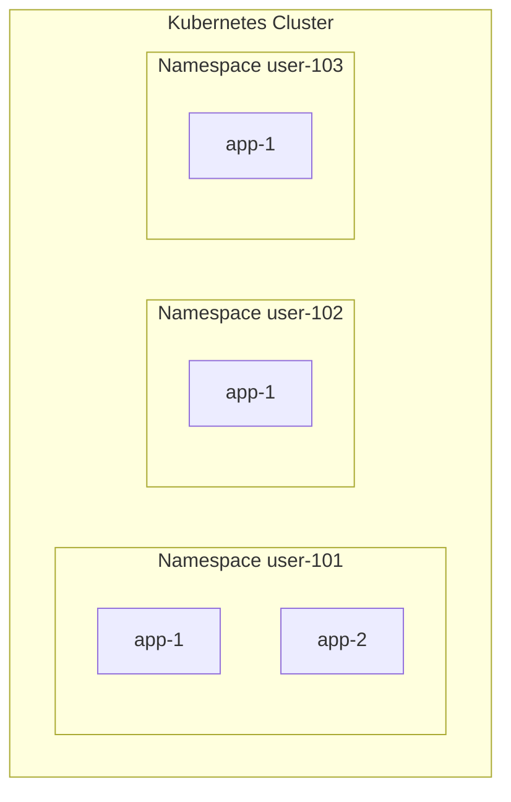

Later additions: NetworkPolicies, ResourceQuotas, LimitRanges, Pod Security Admission, and dedicated node pools.

### 7.3 Health checks and resource limits

| Setting | Purpose |
| :--- | :--- |
| Liveness probe (`/health`) | Is the app alive? Restart it if not. |
| Readiness probe (`/health`) | Can the app receive traffic? Hold traffic until it can. |
| CPU request / limit | `100m` / `500m` |
| Memory request / limit | `128Mi` / `512Mi` |

### 7.4 Autoscaling (later phase)

Horizontal Pod Autoscaler policy: minimum 1 replica, maximum 5, target CPU 70%.

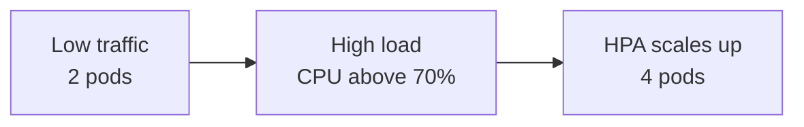

---

## 8. CI/CD and Rollback

### 8.1 Pipeline for DeployHub itself

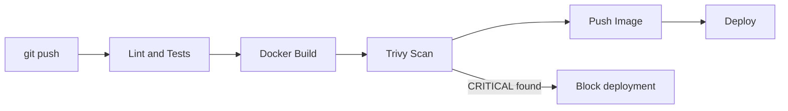

### 8.2 Rollback

Because every image is tagged with an immutable commit SHA, rolling back means redeploying a previous image.

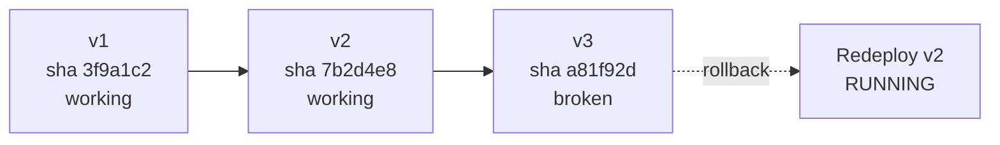

### 8.3 GitHub webhook auto-deploy

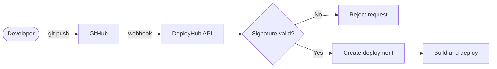

---

## 9. Security Considerations

DeployHub executes user-supplied code, so isolation is essential.

- No privileged containers.
- Never mount `/var/run/docker.sock` into user containers.
- CPU, memory, and process limits on every application.
- Non-root containers where possible.
- Per-user Kubernetes namespaces (later: NetworkPolicies and ResourceQuotas).
- Image scanning with Trivy: block CRITICAL, warn on HIGH.
- Verify GitHub webhook signatures using the webhook secret.
- Never expose host credentials to user containers.
- Never store secrets in Git, Docker images, logs, or normal API responses; use Kubernetes Secrets.
- Rate limit public endpoints (for example login 10/min, deploy 5/min, logs 60/min).
- Enforce authorization: users can only access their own projects, deployments, logs, and variables.

---

## 10. Key Design Decisions

| Decision | Reasoning |
| :--- | :--- |
| **Use Kubernetes instead of a custom scheduler** | Scheduling, restarts, scaling, and networking are solved problems. DeployHub's value is the orchestration layer. |
| **Use Docker/containerd instead of a custom runtime** | Standard, secure, and widely supported. |
| **Use a job queue for builds** | Builds take minutes; the API must respond immediately. |
| **Tag images with the Git commit SHA** | Immutable tags make deployments reproducible and rollbacks reliable. |
| **Generate manifests dynamically (or via Helm)** | Hard-coding YAML per project does not scale. |
| **One namespace per user** | Simple tenant isolation to start; NetworkPolicies and quotas can be layered on later. |
| **Build the core engine before the frontend** | Proves the Repository → Build → Container → URL concept first. |
| **Start with Docker, then move to Kubernetes** | Every phase produces a working system and keeps scope manageable. |

---

## 11. Development Environments

| Environment | Setup |
| :--- | :--- |
| **Local control plane** | Docker Compose: frontend, backend, PostgreSQL, Redis, Prometheus, Grafana |
| **Local Kubernetes** | Kind (lightweight), Minikube, or Docker Desktop Kubernetes |
| **Cloud** | AWS (EC2-based cluster first, EKS later), provisioned with Terraform |

---

## 12. Evolution by Phase

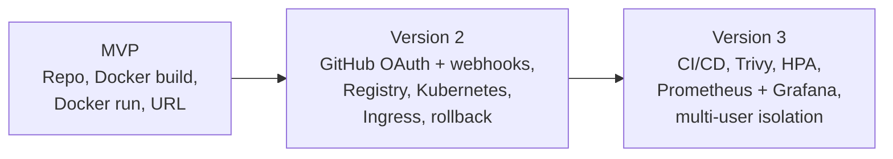

See the [README roadmap](../README.md#-implementation-roadmap) for the phase-by-phase plan.
